# MoE（混合专家模型）完全入门指南

> **阅读对象**：对深度学习和大模型有一定了解，想理解 MoE 架构核心思想的初学者。
>
> **学习目标**：读完本文后，你能用通俗语言解释 MoE 是什么、为什么需要它、它是如何工作的，并能看懂相关论文和模型的架构图。

---

## 📋 阅读地图

| 章节 | 内容 | 难度 | 时间 |
|------|------|------|------|
| [一张图看懂 MoE](#一张图看懂-moe) | 核心概念可视化 | ⭐ | 3 min |
| [为什么需要 MoE？](#为什么需要-moe) | 从传统模型瓶颈讲起 | ⭐ | 5 min |
| [MoE 的三大核心组件](#moe-的三大核心组件) | 门控、专家、路由 | ⭐ | 8 min |
| [从 Dense 到 MoE：架构演变](#从-dense-到-moe架构演变) | 用图示理解结构变化 | ⭐⭐ | 10 min |
| [Top-K 路由详解](#top-k-路由详解) | 门控如何选择专家 | ⭐⭐ | 8 min |
| [负载均衡：防止专家"摸鱼"](#负载均衡防止专家摸鱼) | 训练中的关键挑战 | ⭐⭐ | 7 min |
| [专家并行：多 GPU 协作](#专家并行多-gpu-协作) | 分布式训练可视化 | ⭐⭐ | 8 min |
| [真实模型案例](#真实模型案例) | Mixtral、GPT-4、Switch Transformer | ⭐⭐ | 10 min |
| [代码实现](#代码实现) | PyTorch 概念代码 | ⭐⭐⭐ | 10 min |
| [优势与挑战](#优势与挑战) | 客观看待 MoE | ⭐ | 5 min |
| [常见误区](#常见误区) | 避开理解陷阱 | ⭐ | 5 min |

---

## 一张图看懂 MoE

**MoE** 全称 **Mixture of Experts（混合专家模型）**，核心思想就一句话：

> **让不同的"专家"处理不同类型的输入，而不是用一个"全能选手"处理所有输入。**

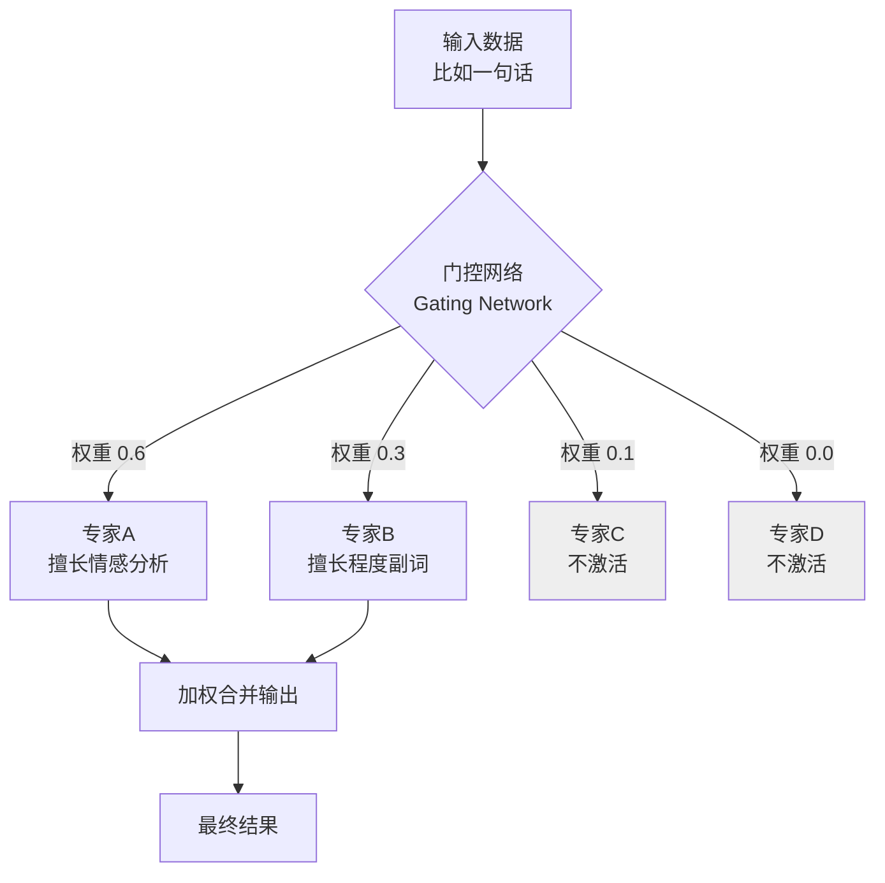

上图展示了一个典型的 MoE 层工作方式：
- **门控网络** 分析输入，给每个专家打分
- 只激活 **Top-2** 个得分最高的专家（图中专家A和专家B）
- 其他专家完全不参与计算（图中灰色）
- 最后把激活专家的输出按权重合并

---

## 为什么需要 MoE？

### 传统 Dense 模型的困境

想象你在运营一家餐厅：

```mermaid
graph LR
    subgraph "传统 Dense 模型 = 一个全能主厨"
        A1[订单: 川菜] --> B1[主厨张三]
        A2[订单: 粤菜] --> B1
        A3[订单: 日料] --> B1
        A4[订单: 西餐] --> B1
        B1 --> C1[所有菜都他做]<br/>累死了!
    end
```

传统神经网络（Dense Model）就是这样：**所有输入都用同一套参数处理**。模型越大，参数越多，每次推理的计算量也越大。

| 模型规模 | 参数量 | 每次推理计算量 | 问题 |
|---------|--------|--------------|------|
| GPT-3 | 1750 亿 | 1750 亿次运算 | 太贵、太慢 |
| GPT-4 (推测) | 1.8 万亿 | 如果用 Dense 架构无法承受 | 成本爆炸 |

### MoE 的解决方案：分工合作

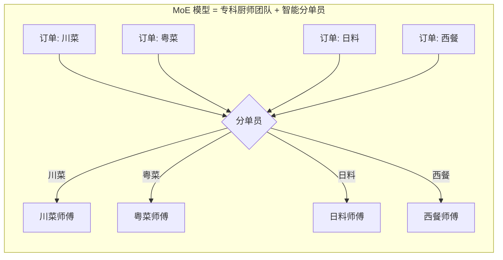

**MoE 的核心洞察**：与其培养一个什么都懂的"全能主厨"，不如组建一个"专科厨师团队"，再配一个"智能分单员"。

- 团队有 8 个专科厨师（专家）
- 但每个订单只派 2 个厨师做（稀疏激活）
- 总团队能力 = 8 人之和，但每单成本 = 2 人之和

> 💡 **关键公式**：
> 
> **MoE 模型总参数量 = 专家数 × 每个专家参数量**（很大）
> 
> **MoE 每次推理计算量 ≈ 激活专家数 × 每个专家计算量**（很小）

---

## MoE 的三大核心组件

MoE 层可以拆解为三个互相配合的部件：

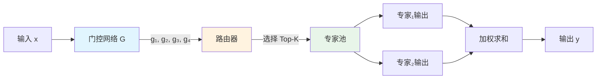

### 1️⃣ 门控网络（Gating Network）—— "智能分单员"

门控网络是一个小型神经网络，通常就是一个简单的线性层 + Softmax：

```
输入向量 x ──→ Linear(x) ──→ 分数 [s₁, s₂, ..., sₙ] ──→ Softmax ──→ 权重 [g₁, g₂, ..., gₙ]
```

它的作用：**给每个专家打分**，表示"这个输入适合交给哪个专家处理"。

类比：快递分拣中心的扫码系统——扫描包裹地址，决定分配给哪个区域的快递员。

### 2️⃣ 专家池（Expert Pool）—— "专科厨师团队"

每个"专家"本质上就是一个标准的神经网络子模块（通常是前馈网络 FFN）：

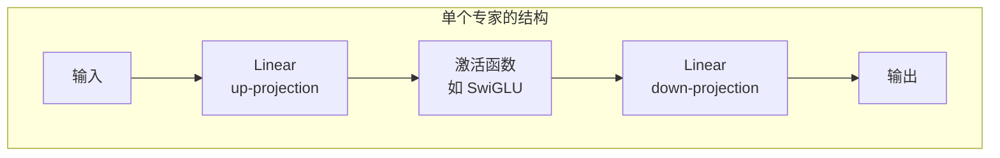

在 Transformer 中，MoE 通常替换的是 **FFN 层**（Feed-Forward Network），保留 Attention 层不变。

### 3️⃣ 路由器（Router）—— "调度系统"

路由器根据门控网络的输出，执行两个操作：
1. **选择**：选出得分最高的 K 个专家（Top-K）
2. **加权**：用 Softmax 归一化后的权重，合并选中专家的输出

```
门控输出: [0.1, 0.05, 0.4, 0.3, 0.15]
           专家1 专家2 专家3 专家4 专家5

Top-2 选择: 专家3 (0.4) + 专家4 (0.3)
Softmax 归一化: [0.4, 0.3] → [0.57, 0.43]

最终输出 = 0.57 × 专家3(x) + 0.43 × 专家4(x)
```

---

## 从 Dense 到 MoE：架构演变

### 传统 Transformer 的一个层

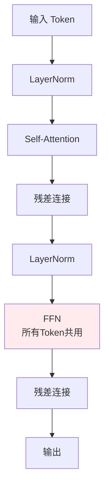

每个 Token 都经过**同一个 FFN**（红色），这是 Dense 架构的核心特征。

### MoE Transformer 的一个层

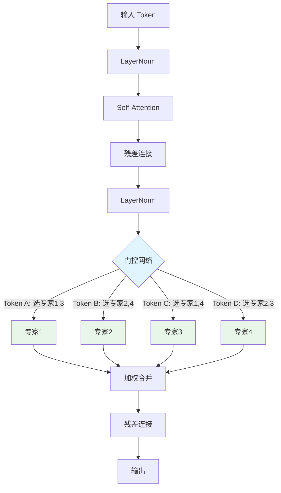

**关键变化**：FFN 被替换成了 **MoE 层**，每个 Token 可以根据自己的特点，选择不同的专家组合。

> 📌 **注意**：MoE 通常只替换 FFN 层，Attention 层保持不变。因为 Attention 负责"看哪里"，FFN 负责"学什么知识"——知识可以分专家，但注意力机制通常是通用的。

### 参数对比可视化

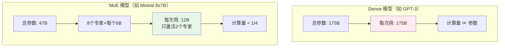

---

## Top-K 路由详解

Top-K 路由是 MoE 最经典的路由策略。让我们用一个具体例子来理解：

### 路由过程可视化

假设有 8 个专家，当前输入是一个 Token `"人工智能"`：

```
步骤 1: 门控网络打分
┌────────────────────────────────────────────┐
│ 专家0  专家1  专家2  专家3  专家4  专家5  专家6  专家7 │
│  0.05   0.12   0.03   0.25   0.08   0.30   0.10   0.07 │
│     ░░░░░░░░░░░░░░░░░░░░░░░░░░░░░░░░░░░░░░░░░░░░░░░░     │
│     ██░░░░░░░░░░░░░░░░░░░░░░░░░░░░░░░░░░░░░░░░░░░░░░     │ 专家0
│     ░░████░░░░░░░░░░░░░░░░░░░░░░░░░░░░░░░░░░░░░░░░░░     │ 专家1
│     ░░░░█░░░░░░░░░░░░░░░░░░░░░░░░░░░░░░░░░░░░░░░░░░░     │ 专家2
│     ░░░░░░████████░░░░░░░░░░░░░░░░░░░░░░░░░░░░░░░░░░     │ 专家3 ✓
│     ░░░░░░░░░░░░░░██░░░░░░░░░░░░░░░░░░░░░░░░░░░░░░░░     │ 专家4
│     ░░░░░░░░░░░░░░░░░░████████████░░░░░░░░░░░░░░░░░░     │ 专家5 ✓
│     ░░░░░░░░░░░░░░░░░░░░░░░░░░░░░░███░░░░░░░░░░░░░░░     │ 专家6
│     ░░░░░░░░░░░░░░░░░░░░░░░░░░░░░░░░░░██░░░░░░░░░░░░     │ 专家7
└────────────────────────────────────────────┘

步骤 2: Top-2 选择
选中: 专家5 (0.30) 和 专家3 (0.25)

步骤 3: Softmax 归一化
[0.30, 0.25] → [0.545, 0.455]

步骤 4: 加权求和
输出 = 0.545 × 专家5("人工智能") + 0.455 × 专家3("人工智能")
```

### Noisy Top-K：加入"探索噪声"

原始的 Top-K 有个问题：训练初期门控网络可能随机地偏好某些专家，然后这些专家学得更好，门控就更倾向选它们……形成**马太效应**，最终只用 1-2 个专家。

解决方案：在路由分数上加入高斯噪声，鼓励探索：

```
有噪声分数 = 原始分数 + ε, 其中 ε ~ N(0, 噪声强度)
```

类比：推荐系统偶尔给用户推荐一些"意料之外"的内容，防止信息茧房。

---

## 负载均衡：防止专家"摸鱼"

### 问题：专家坍塌（Expert Collapse）

理想情况下，8 个专家应该平均分担工作：

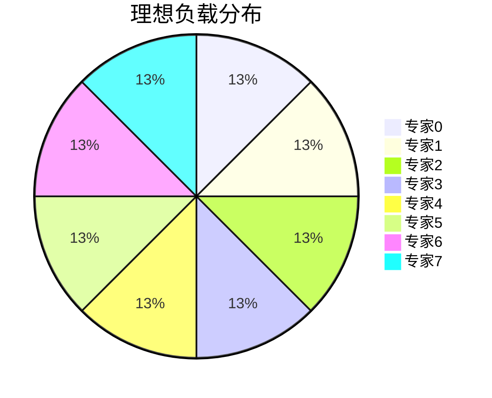

但现实可能是：

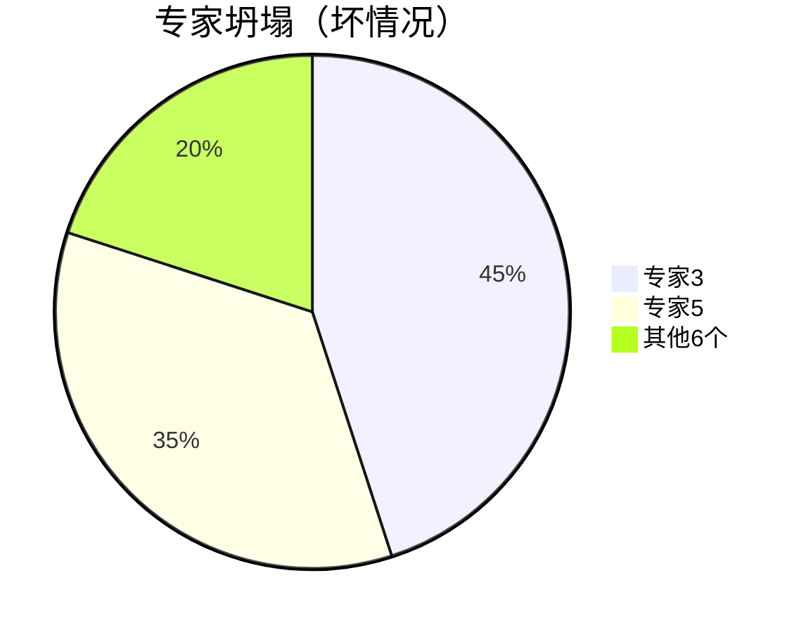

后果：
- 专家3 和 专家5 "过劳"，学得越来越杂
- 其他专家"摸鱼"，从未被训练
- 模型退化成一个只有 2 个专家的系统

### 解决方案：辅助损失函数

训练时加入一个**负载均衡损失**，惩罚负载不均衡的情况：

```
总损失 = 任务损失 + α × 负载均衡损失

负载均衡损失 = Σ(专家i的期望使用率 × 专家i的实际使用率)
```

直觉上：
- 如果某个专家被用得太少，损失会变大
- 梯度会告诉门控网络："多给这个专家一些机会"

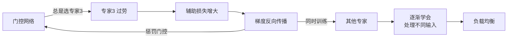

---

## 专家并行：多 GPU 协作

当专家数量很多时（比如 64 个或 128 个），单个 GPU 放不下所有专家。这时候需要**专家并行（Expert Parallelism）**。

### 数据并行 vs 专家并行

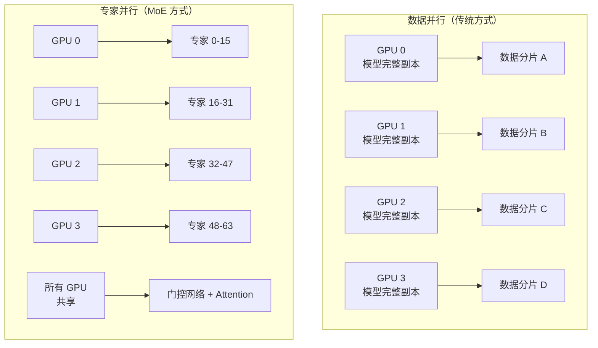

**专家并行的核心思想**：
- 把不同的专家放在不同的 GPU 上
- 门控网络和 Attention 层在每个 GPU 上都有副本
- 当 Token 需要专家 3 时，通过网络通信把 Token 发送到持有专家 3 的 GPU

### All-to-All 通信

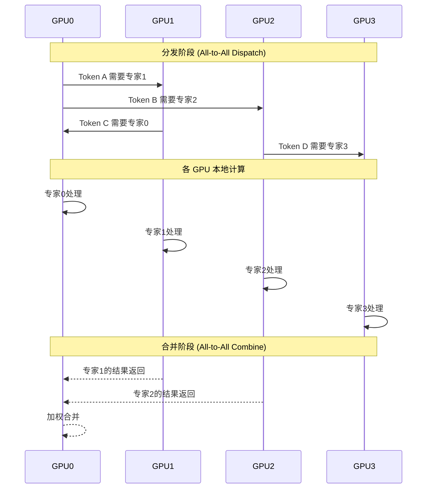

> ⚠️ **通信开销是 MoE 的痛点**：每次路由都需要跨 GPU 传输数据，网络带宽成为瓶颈。这也是 MoE 推理延迟通常比 Dense 模型高的原因之一。

---

## 真实模型案例

### Mixtral 8x7B（最知名的开源 MoE）

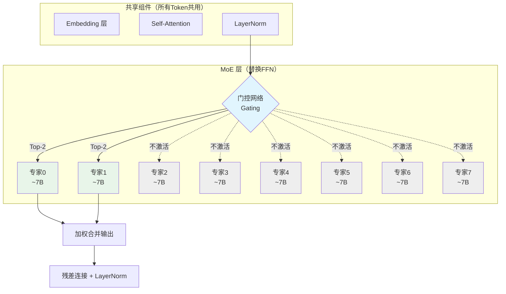

> 参考来源：[Hugging Face MoE 博客](https://huggingface.co/blog/moe)

**关键参数**：
- 总专家数：8 个
- 激活专家数：Top-2
- 每个专家约 7B 参数
- **总参数量**：约 47B（不是 56B，因为 Embedding 和 Attention 是共享的）
- **激活参数量**：约 12B（= 2 × 7B 专家 + 共享参数）

**性能对比**：

| 模型 | 总参数 | 激活参数 | MMLU 分数 |
|------|--------|---------|----------|
| LLaMA-2 70B | 70B | 70B | 69.8 |
| Mixtral 8x7B | 47B | 12B | 70.6 |

**核心洞察**：用 **1/6 的激活计算量**，达到了 **超越 70B Dense 模型** 的效果！

### Switch Transformer（Google，首个万亿参数 MoE）

**创新点**：把 Top-K 简化为 **Top-1**（每个 Token 只路由给 1 个专家）：

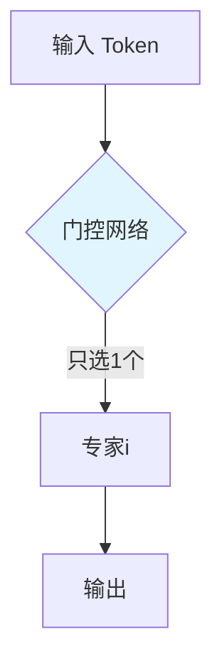

- **专家数量**：2048 个
- **总参数量**：1.6 万亿
- **每个 Token 激活参数**：约 2 亿（仅 0.0125%）

> "Switch" 的含义：像铁路道岔一样，把每个 Token "切换" 到唯一的轨道上。

### GPT-4（推测使用 MoE）

虽然 OpenAI 没有公开 GPT-4 的架构细节，但业界普遍推测：

| 推测参数 | 数值 |
|---------|------|
| 总参数量 | 约 1.8 万亿 |
| 专家数量 | 8-16 个 |
| 激活专家数 | Top-2 |
| 每个专家参数量 | 约 1000-2000 亿 |

这种架构解释了为什么 GPT-4 的能力远超 GPT-3.5，但推理成本没有同等比例增长。

### Qwen2-57B-A14B（阿里通义千问 MoE）

| 参数 | 数值 |
|------|------|
| 总参数量 | 57B |
| 专家数量 | 64 个 |
| 激活专家数 | Top-8 |
| 激活参数量 | 14B |

---

## 代码实现

以下是 PyTorch 风格的概念性实现，帮助你理解 MoE 层的内部逻辑：

```python
import torch
import torch.nn as nn
import torch.nn.functional as F

class MoELayer(nn.Module):
    """
    简化的 MoE 层实现（用于理解概念）
    
    参数:
        d_model: 模型维度
        num_experts: 专家总数
        top_k: 每次激活的专家数
        expert_hidden: 每个专家的隐藏层维度
    """
    def __init__(self, d_model=512, num_experts=8, top_k=2, expert_hidden=2048):
        super().__init__()
        self.num_experts = num_experts
        self.top_k = top_k
        self.d_model = d_model
        
        # 1. 门控网络：一个小型线性层
        self.gate = nn.Linear(d_model, num_experts)
        
        # 2. 专家池：每个专家是一个两层的 FFN
        self.experts = nn.ModuleList([
            nn.Sequential(
                nn.Linear(d_model, expert_hidden),
                nn.GELU(),
                nn.Linear(expert_hidden, d_model)
            )
            for _ in range(num_experts)
        ])
        
    def forward(self, x):
        """
        输入 x: [batch_size, seq_len, d_model]
        输出: [batch_size, seq_len, d_model]
        """
        batch_size, seq_len, d_model = x.shape
        
        # 把 batch 和 seq 维度合并，方便处理
        # [batch_size * seq_len, d_model]
        x_flat = x.view(-1, d_model)
        
        # ========== 步骤 1: 门控打分 ==========
        # [batch_size * seq_len, num_experts]
        gate_logits = self.gate(x_flat)
        
        # ========== 步骤 2: Top-K 路由 ==========
        # 选出每个 Token 的 Top-K 专家和权重
        # top_k_weights: [batch_size * seq_len, top_k]
        # top_k_indices: [batch_size * seq_len, top_k]
        top_k_weights, top_k_indices = torch.topk(
            F.softmax(gate_logits, dim=-1), 
            self.top_k, 
            dim=-1
        )
        
        # 对权重做归一化（可选，但常用）
        top_k_weights = top_k_weights / top_k_weights.sum(dim=-1, keepdim=True)
        
        # ========== 步骤 3: 专家计算 ==========
        # 正确的做法：按 position（top-k 的第几个）遍历，而不是按 expert 遍历
        output = torch.zeros_like(x_flat)

        for k_idx in range(self.top_k):
            # 获取所有 Token 在第 k_idx 位置选择的专家
            expert_ids = top_k_indices[:, k_idx]  # shape: [batch*seq]
            # 获取对应的权重
            weights = top_k_weights[:, k_idx]    # shape: [batch*seq]

            for expert_idx in range(self.num_experts):
                # 找出哪些 Token 在第 k_idx 位置选择了专家 expert_idx
                mask = (expert_ids == expert_idx)

                if mask.any():
                    # 获取这些 Token 的输入
                    expert_input = x_flat[mask]
                    # 计算专家输出
                    expert_output = self.experts[expert_idx](expert_input)
                    # 获取这些 Token 对应的权重
                    w = weights[mask].unsqueeze(1)
                    # 加权累加到输出
                    output[mask] += w * expert_output
        
        # 恢复原始形状
        return output.view(batch_size, seq_len, d_model)


# ========== 使用示例 ==========
if __name__ == "__main__":
    # 创建一个 MoE 层
    moe_layer = MoELayer(
        d_model=512,
        num_experts=8,
        top_k=2,
        expert_hidden=2048
    )
    
    # 模拟输入：batch=2, seq_len=10, dim=512
    x = torch.randn(2, 10, 512)
    
    # 前向传播
    output = moe_layer(x)
    print(f"输入形状: {x.shape}")
    print(f"输出形状: {output.shape}")
    print(f"总参数量: {sum(p.numel() for p in moe_layer.parameters()) / 1e6:.1f}M")
```

> ⚠️ **注意**：上面的代码是**教学用简化版**，实际生产环境需要用更高效的路由实现（如 Megablocks、Tutel、DeepSpeed-MoE 等库），处理负载均衡、专家并行、内存优化等问题。

---

## 优势与挑战

### ✅ MoE 的优势

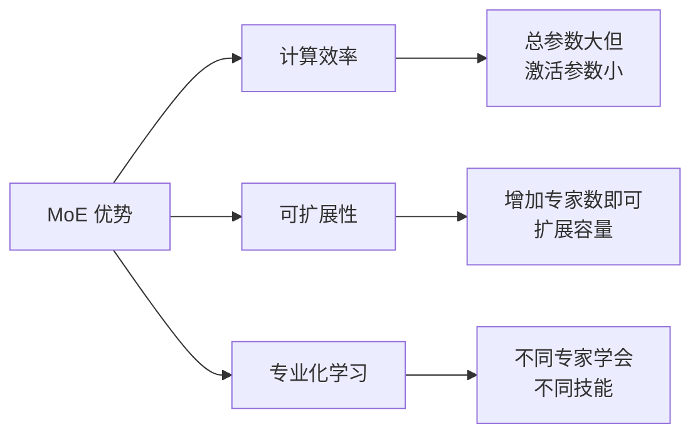

| 优势 | 说明 |
|------|------|
| **参数高效** | 47B 总参数的 MoE，推理成本接近 12B Dense 模型 |
| **容量巨大** | 可以轻松扩展到万亿参数级别 |
| **专业分工** | 专家自然形成 specialization（代码专家、数学专家、中文专家等） |
| **持续扩展** | 新增专家不需要重新训练整个模型 |

### ❌ MoE 的挑战

| 挑战 | 说明 | 解决方向 |
|------|------|---------|
| **通信开销** | 专家并行需要跨 GPU 传输数据 | 优化 All-to-All 通信、使用 NVLink |
| **内存占用** | 总参数量大，显存需求高 | 量化、CPU offloading、专家卸载 |
| **推理延迟** | 相比同激活参数的 Dense 模型，延迟更高 | 推测解码、专家缓存 |
| **训练不稳定** | 负载均衡难以控制，容易坍塌 | 辅助损失、容量因子、专家 dropout |
| **部署复杂** | 需要专门的推理框架支持 | vLLM、TensorRT-LLM、TGI |

---

## 常见误区

### ❌ 误区 1："MoE 模型总参数 = 激活参数"

**错误理解**：Mixtral 8x7B 有 47B 参数，所以推理成本和 47B Dense 模型一样。

**正确理解**：Mixtral 每次推理只激活约 **12B 参数**，成本更接近 12B Dense 模型，但性能接近 70B Dense 模型。

### ❌ 误区 2："专家 = 独立的子模型"

**错误理解**：8 个专家就是 8 个独立训练的小模型拼在一起。

**正确理解**：专家和门控网络是**端到端联合训练**的。门控网络学习"如何分派"，专家学习"如何处理分派给自己的输入"——两者互相影响、共同进化。

### ❌ 误区 3："MoE 一定比 Dense 好"

**错误理解**：所有场景都应该用 MoE。

**正确理解**：
- **小模型**（< 10B）：Dense 通常更好，MoE 的 overhead 不划算
- **对延迟敏感**的场景（如实时对话）：Dense 延迟更稳定
- **追求极致性能/参数比**：MoE 是更好的选择

### ❌ 误区 4："Top-K 越大越好"

**错误理解**：激活 4 个专家一定比激活 2 个好。

**正确理解**：
- K 越大 → 计算量越大
- 收益递减：从 Top-1 到 Top-2 提升明显，Top-2 到 Top-4 提升有限
- 实际常用：Top-1（Switch）或 Top-2（Mixtral）

---

## 学习资源

### 必读论文

| 论文 | 年份 | 核心贡献 |
|------|------|---------|
| [Outrageously Large Neural Networks](https://arxiv.org/abs/1701.06538) | 2017 | 稀疏门控 MoE 奠基之作 |
| [Switch Transformers](https://arxiv.org/abs/2101.03961) | 2021 | 简化为 Top-1 路由，首个万亿参数模型 |
| [GLaM](https://arxiv.org/abs/2112.06905) | 2021 | Google 的 MoE 语言模型 |
| [Mixtral 8x7B](https://arxiv.org/abs/2401.04088) | 2024 | 开源 MoE 的标杆 |

### 推荐阅读

- [Hugging Face: Mixture of Experts Explained](https://huggingface.co/blog/moe) —— 最直观的 MoE 图解教程
- [Google AI Blog: Switch Transformer](https://ai.googleblog.com/2021/02/switch-transformers-trillion-parameter.html) —— Google 官方解读
- [The Pile: MoE Training](https://pile.eleuther.ai/) —— 大规模 MoE 训练实践

### 开源框架

| 框架 | 用途 |
|------|------|
| [Megablocks](https://github.com/stanford-futuredata/megablocks) | 高效的 MoE 训练库（Stanford） |
| [Tutel](https://github.com/microsoft/tutel) | 微软的 MoE 优化库 |
| [DeepSpeed-MoE](https://www.deepspeed.ai/tutorials/moe/) | 微软的分布式 MoE 训练 |
| [vLLM](https://github.com/vllm-project/vllm) | 支持 MoE 的高效推理 |

---

> 🎓 **总结一句话**：
> 
> MoE 是**"用空间换效率"**的典范——通过增加总参数量（空间），让每个输入只使用一小部分参数（效率），从而在有限的计算预算下获得更强的模型能力。理解门控、稀疏激活和负载均衡，就掌握了 MoE 的精髓。
>
> 如果你只能记住三个关键词，请记住：**门控（Gating）、稀疏激活（Sparse Activation）、负载均衡（Load Balancing）**。
