# spring bean 生命周期

## 生命周期

Bean 的生命周期 = 实例化 → 属性填充 → Aware 回调 → BeanPostProcessor 前置处理 → 初始化 → BeanPostProcessor 后置处理（AOP 在这里完成） → 就绪使用 → 销毁

```mermaid
flowchart TD
    A[容器启动] --> B[解析配置/扫描类]
    B --> C[Bean定义加载]
    C --> D[BeanDefinition注册]
    
    D --> E[Bean实例化阶段]
    E --> F[实例化Bean<br/>构造函数/工厂方法]
    
    F --> G[依赖注入阶段]
    G --> H[属性填充<br/>setter/字段注入]
    
    H --> I[Aware接口回调阶段]
    I --> I1[BeanNameAware.setBeanName]
    I1 --> I2[BeanClassLoaderAware.setBeanClassLoader]
    I2 --> I3[BeanFactoryAware.setBeanFactory]
    I3 --> I4[EnvironmentAware.setEnvironment]
    I4 --> I5[EmbeddedValueResolverAware.setEmbeddedValueResolver]
    I5 --> I6[ResourceLoaderAware.setResourceLoader]
    I6 --> I7[ApplicationEventPublisherAware.setApplicationEventPublisher]
    I7 --> I8[MessageSourceAware.setMessageSource]
    I8 --> I9[ApplicationContextAware.setApplicationContext]
    
    I9 --> J[BeanPostProcessor前置处理]
    J --> J1[postProcessBeforeInitialization]
    
    J1 --> K[初始化阶段]
    K --> K0[PostConstruct注解方法执行]
    K0 --> K1[InitializingBean.afterPropertiesSet]
    K1 --> K2[自定义init-method]
    
    K2 --> L[BeanPostProcessor后置处理]
    L --> L1[postProcessAfterInitialization]
    
    L1 --> M[AOP代理创建<br/>如果需要]
    
    M --> N[Bean就绪可用]
    
    N --> O[容器运行期]
    O --> P[Bean使用中]
    
    P --> Q[容器关闭]
    Q --> R[销毁阶段]
    R --> R0[PreDestroy注解方法执行]
    R0 --> R1[DisposableBean.destroy]
    R1 --> R2[自定义destroy-method]
    
    R2 --> S[Bean销毁完成]
    
    %% 异常路径
    J --> T[初始化异常]
    K --> T
    K0 --> T
    K1 --> T
    K2 --> T
    L --> T
    T --> U[销毁已创建部分]
    U --> V[抛出异常]
    
    %% 配色方案（与之前保持一致）
    classDef stage1 fill:#1e3a8a,stroke:#3b82f6,color:#ffffff
    classDef stage2 fill:#581c87,stroke:#a855f7,color:#ffffff
    classDef stage3 fill:#0e7490,stroke:#06b6d4,color:#ffffff
    classDef stage4 fill:#166534,stroke:#22c55e,color:#ffffff
    classDef stage5 fill:#ea580c,stroke:#f97316,color:#ffffff
    classDef stage6 fill:#374151,stroke:#6b7280,color:#ffffff
    classDef exception fill:#dc2626,stroke:#ef4444,color:#ffffff
    classDef annotation fill:#9333ea,stroke:#a855f7,color:#ffffff
    
    %% 节点分类
    class A,B,C,D stage1
    class E,F stage2
    class G,H stage3
    class I,I1,I2,I3,I4,I5,I6,I7,I8,I9 stage4
    class J,J1 stage5
    class K,K0,K1,K2,L,L1,M stage5
    class N,O,P stage6
    class Q,R,R0,R1,R2,S stage1
    class T,U,V exception
    class K0,R0 annotation
```

### 初始化

spring beean 初始化时调用方式：
(1) 添加了 @PostConstruct 的方法
(2) 实现了 InitializingBean 的 afterPropertiesSet 方法
(3) 在 \<bean/> 中配置的 init-method 或者 @Bean 中配置 initMethod

### 销毁

(1) 添加了 @PreDestroy 的方法
(2) 实现了 DisposableBean 的 destroy 方法
(3) 在 \<bean/> 中配置的 destroy-method 或者 @Bean 中配置 destroyMethod

## 事件机制

事件机制基于观察者设计模式（发布 - 订阅模式） 实现的轻量级组件间解耦通信机制，核心作用是让容器内的组件无需直接依赖，通过「发布事件、订阅事件」的方式完成消息传递，尤其适合处理业务解耦场景（比如订单创建后，库存扣减、日志记录、消息推送等逻辑独立订阅事件）。
ApplicationContext 提供了一套事件机制，在容器发生变动时可以通过ApplicationEvent子类通知到ApplicationListener接口的实现类，做处理。

