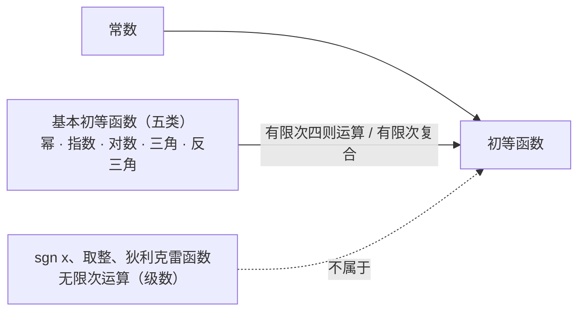

# 界与函数

> **定位**：考研数一第一章「函数、极限、连续」的起点笔记，覆盖教材最前的基础内容：实数的界与确界 → 函数的概念与性质 → 初等函数 → 参数方程与极坐标 → 函数图形变换。
> 建议先读本文，再进入 [[topics/math/inequalities]]（有界性估计与不等式放缩的前置语言）和极限部分。
> 导航：[[notes/MOC - math]]

**目录**

- [一、实数的界与确界](#一实数的界与确界)：[上界与下界](#11-上界与下界) · [上确界与下确界](#12-上确界与下确界) · [确界存在定理](#13-确界存在定理) · [函数的界](#14-函数的界)
- [二、函数](#二函数)：[函数的概念](#21-函数的概念) · [四种性质](#22-函数的四种性质) · [初等函数](#23-初等函数) · [参数方程](#24-参数方程) · [极坐标](#25-极坐标) · [图形变换](#26-函数图形变换)
- [三、与其他笔记的联系](#三与其他笔记的联系)
- [附：自测清单](#附自测清单)

## 一、实数的界与确界

> 这一组概念回答两个问题：一组数整体"卡"在哪里（**界**）？最紧的那个卡口在哪里（**确界**）？确界语言是极限与连续理论的基石，也是"实数比有理数多出了什么"的第一个答案。

### 1.1 上界与下界

> **定义（上界 / 下界 / 有界）** 设 $E$ 是非空数集。若存在实数 $M$，使得对一切 $x\in E$ 都有 $x\le M$，则称 $M$ 是 $E$ 的一个**上界**，$E$ **有上界**；若存在实数 $m$，使得对一切 $x\in E$ 都有 $x\ge m$，则称 $m$ 是 $E$ 的**下界**，$E$ **有下界**。既有上界又有下界的数集称为**有界集**。

**要点**：

- **界不唯一**：若 $M$ 是 $E$ 的上界，则一切大于 $M$ 的数都是上界。$E=(0,1)$ 的上界有 $1,\ 2,\ 100,\ \ldots$，下界有 $0,\ -3,\ \ldots$
- **有界的合并写法**：$E$ 有界 $\iff$ 存在 $K>0$，使 $\lvert x\rvert\le K$ 对一切 $x\in E$ 成立——上、下界合并成一条对称的绝对值不等式。
- **可以只有单侧**：正整数集 $\{1,2,3,\ldots\}$ 有下界（如 $1$）但没有上界；数集 $\{-n\}$ 有上界没有下界。
- 有界是**整体性质**：肯定它要求一个界管住**全部**元素；否定它则要对每个候选界 $K$ 都能指出越界的点（常见做法：取一列模趋于无穷的点）。

### 1.2 上确界与下确界

有上界的数集有无穷多个上界，自然要问：**最小的那个上界是谁？**它就是上确界。

> **定义（上确界 / 下确界）** 设 $E$ 非空且有上界。$E$ 的最小上界称为**上确界**，记作 $\sup E$；$E$ 的最大下界称为**下确界**，记作 $\inf E$。$\sup E$ 精确地满足两条：
>
> 1. **它是上界**：对一切 $x\in E$，有 $x\le\sup E$；
> 2. **再小一点就不行**：对任意 $\varepsilon>0$，存在 $x\in E$，使 $x>\sup E-\varepsilon$。
>
> 同理，$\inf E$ 满足：对一切 $x\in E$，$x\ge\inf E$；且对任意 $\varepsilon>0$，存在 $x\in E$，使 $x<\inf E+\varepsilon$。

第 2 条不是装饰，它把"最小"翻译成可操作的语言：**不管理想的 $\varepsilon$ 多小，集合里总能找到逼近确界的点**。用这两条性质去"验证某数是上确界"是考研证明题的基本功。

**例 1**：$E=(0,1)$：$\sup E=1$，$\inf E=0$，但 $1,0\notin E$，故 $E$ 既无最大值也无最小值——**确界可以不属于集合**。

**例 2**：$E=\{x:x^2<2\}=(-\sqrt2,\sqrt2)$：$\sup E=\sqrt2\notin E$。若把范围限制在有理数里，这个"最小上界"根本不存在（见下节）。

**例 3**：有限集 $E=\{1,2\}$：$\max E=\sup E=2$，$\min E=\inf E=1$——确界都被取到。

**$\max/\min$ 与 $\sup/\inf$ 的区别**：

| 概念 | 与集合的关系 | 存在条件 | 备注 |
|:---|:---|:---|:---|
| 最大值 $\max E$ | 必须**属于** $E$ | 通常要求 $E$ 有限，或闭且上有界 | 存在时唯一 |
| 上确界 $\sup E$ | **可以不属于** $E$ | 非空 + 有上界即可（确界存在定理） | 恒唯一 |
| 最小值 $\min E$ | 必须属于 $E$ | 通常要求 $E$ 有限，或闭且下有界 | 存在时唯一 |
| 下确界 $\inf E$ | 可以不属于 $E$ | 非空 + 有下界即可 | 恒唯一 |

一句话：**$\max$ 是被取到的上确界**。$\max E$ 存在时必有 $\max E=\sup E$；反之不成立（例 1、例 2）。

### 1.3 确界存在定理

> **定理（确界存在定理）** 非空且有上界的实数集 $E$ 必有上确界 $\sup E\in\mathbb{R}$；非空且有下界的实数集必有下确界 $\inf E\in\mathbb{R}$。

**它到底说了什么**：

- 定理的结论不是"存在上界"（这是前提），而是**无穷多个上界里最小的一个真的存在、而且是实数**。上界集合 $\{M:\ M\ \text{是}\ E\ \text{的上界}\}$ 非空，定理保证它有最小元。
- 这不是显然的！它是**实数完备性（连续性）**的刻画之一。有理数系不满足它：$E=\{x\in\mathbb{Q}:x^2<2\}$ 非空、有上界，但按"最小上界"它应当是 $\sqrt2$——不是有理数，于是在 $\mathbb{Q}$ 内这个上确界**不存在**。实数系填上了这个缺口，这就是实数与有理数的本质差别。
- **实数完备性定理家族**（彼此等价，可互相证明，知道名字即可）：
  - 确界存在定理；
  - 单调有界数列必有极限；
  - 闭区间套定理；
  - 聚点定理（Bolzano–Weierstrass）；
  - 有限覆盖定理（Heine–Borel）。
- 后续课程的两大支柱都落脚在它上面：**单调有界定理**（数列收敛判别，第二章常用）与**闭区间上连续函数的有界性、最值定理**（第一章末尾 / 连续部分）。

**考研定位**：很少直接考定理本身的证明，但（1）用 $\sup/\inf$ 的两条性质写定义型证明是基本功；（2）级数、反常积分敛散性讨论中的"上界、上确界"是标准语言；（3）"单调有界"这条推导链的方向（确界定理 $\Rightarrow$ 单调有界定理）要在心里有图。

### 1.4 函数的界

把数集的界翻译到函数上，看的是**值域** $f(I)$ 这个数集。

> **定义（有界函数）** 设 $f$ 在数集 $I$ 上有定义。若存在 $M>0$，使 $\lvert f(x)\rvert\le M$ 对一切 $x\in I$ 成立，则称 $f$ 在 $I$ 上**有界**；否则称**无界**。当值域的 $\sup$、$\inf$ 存在时，分别称为 $f$ 在 $I$ 上的上、下确界。

- **几何**：有界函数的图像能被水平线 $y=M$ 与 $y=-M$ 完全夹住。
- **有界性绑定区间**：脱离区间谈有界没有意义。$f(x)=\dfrac1x$ 在 $(0,1)$ 内无界（$x\to 0^{+}$ 时函数值无限制增大），但在 $[1,+\infty)$ 上有界（$\lvert 1/x\rvert\le 1$）。
- **无界的严格说法**：对任何 $M>0$，总存在 $x_M\in I$ 使 $\lvert f(x_M)\rvert>M$。证无界的标准姿势：指出一列点，使函数值沿它趋于无穷。

**常用函数的界速查**：

| 函数 | 区间 | $\inf$ | $\sup$ | $\min/\max$ |
|:---|:---:|:---:|:---:|:---|
| $\sin x,\ \cos x$ | $\mathbb{R}$ | $-1$ | $1$ | 都取到 |
| $\arctan x$ | $\mathbb{R}$ | $-\dfrac{\pi}{2}$ | $\dfrac{\pi}{2}$ | 都取不到 |
| $e^{x}$ | $\mathbb{R}$ | $0$ | 无上界 | 都没有 |
| $\dfrac{1}{x}$ | $(0,1)$ | $1$ | 无上界 | 无 $\min$（$1$ 取不到）、无 $\max$ |
| $x^{2}$ | $[-1,2]$ | $0$ | $4$ | 都取到 |

## 二、函数

### 2.1 函数的概念

> **定义** 设 $D$ 是非空数集。若对每个 $x\in D$，按某个对应法则 $f$ 都有**唯一确定**的实数 $y$ 与之对应，则称 $f$ 是定义在 $D$ 上的函数，记作 $y=f(x)$；$D$ 叫**定义域**，$f(D)=\{f(x):x\in D\}$ 叫**值域**。

- **两要素**：定义域 + 对应法则。判断两个函数相同只看这两条，与用什么字母无关：$y=x^2$ 与 $s=t^2$ 是同一个函数；而 $f(x)=x$ 与 $g(x)=\dfrac{x^2}{x}$ 不同——后者的定义域不含 $0$。
- "唯一确定"排除了多值对应：整条抛物线 $x=y^2$ 不能写成 $y$ 对 $x$ 的函数（一个 $x$ 对两个 $y$）。
- **分段函数是一个函数**（几段表达式共享同一个定义域），不是几个函数的拼盘：
  $$
  \lvert x\rvert=\begin{cases}x, & x\ge 0,\\ -x, & x<0,\end{cases}
  \qquad
  \operatorname{sgn}x=\begin{cases}-1, & x<0,\\ 0, & x=0,\\ 1, & x>0.\end{cases}
  $$
  分段点处的函数值、左右极限与连续性（后续章节）是高频考点。

**反函数**：设 $f$ 在 $D$ 上是一一对应（如严格单调），值域为 $f(D)$，则对每个 $y\in f(D)$ 有唯一的 $x\in D$ 使 $y=f(x)$，这个新对应称为**反函数**。把 $x,y$ 位置互换写成 $y=f^{-1}(x)$ 后，其图像与 $y=f(x)$ 关于直线 $y=x$ 对称。

- 例：$y=e^{x}$ 与 $y=\ln x$；$y=x^2$ 只在 $[0,+\infty)$ 上有反函数 $\sqrt{x}$（在 $\mathbb{R}$ 上不一一对应）。
- $y=\sin x$ 之所以要限制在 $[-\tfrac{\pi}{2},\tfrac{\pi}{2}]$ 上才谈 $\arcsin$，正是因为**单调（一一对应）才保证反函数存在**——这是反三角函数"主值区间"的来历。

**复合函数**：已知 $y=f(u)$（定义域 $U$）与 $u=g(x)$（值域为 $G$），若 $G\subseteq U$（接得上），则 $y=f(g(x))$ 是复合函数。

- **接不上就不能复合**：$y=\arcsin u$ 与 $u=x^2+2$ 不能复合，因为 $u\ge 2$ 落在 $[-1,1]$ 之外。
- **分解复合**是基本功：$y=\sin^2(3x+1)$ 拆成 $y=u^2,\ u=\sin v,\ v=3x+1$。第二章的链式求导、第三章的换元积分都建立在这个动作上。
- 反函数与原函数互相抵消：$f\bigl(f^{-1}(y)\bigr)=y$，$f^{-1}\bigl(f(x)\bigr)=x$。

### 2.2 函数的四种性质

| 性质 | 定义（区间 $I$ 上） | 图形特征 | 一句话记忆 |
|:---|:---|:---|:---|
| 有界性 | $\exists M>0$，$\lvert f(x)\rvert\le M$ | 被两条水平线夹住 | 高度有限 |
| 单调性 | $x_1<x_2\Rightarrow f(x_1)<f(x_2)$（增） | 一路上爬 / 一路下滑 | 保持顺序 |
| 奇偶性 | 奇：$f(-x)=-f(x)$；偶：$f(-x)=f(x)$ | 原点对称 / $y$ 轴对称 | 定义域先要对称 |
| 周期性 | $\exists T>0$，$f(x+T)=f(x)$ | 平移 $T$ 后重合 | 整段循环 |

**（1）有界性**

- 判定思路：公式估计（配合绝对值不等式、均值不等式，见 [[topics/math/inequalities]]）；闭区间上连续函数必有界（连续章节的定理）；单调 + 有界 ⇒ 有极限（单调有界定理）。
- 典型例子：$\sin x,\ \cos x$ 在 $\mathbb{R}$ 上有界；$\lvert\arctan x\rvert<\dfrac{\pi}{2}$；$x\sin x$ 在 $\mathbb{R}$ 上**无界**——取 $x=\dfrac{\pi}{2}+2k\pi$ 时 $x\sin x=x$ 可任意大。这也是"有界 × 有界 = 有界，有界 × 无界 = 不一定"的反例库。
- 有界性依赖区间再看一例：$\tan x$ 在 $(-\tfrac{\pi}{2},\tfrac{\pi}{2})$ 无界，但在任何闭子区间 $[a,b]\subset(-\tfrac{\pi}{2},\tfrac{\pi}{2})$ 上有界。

**（2）单调性**

- **定义法判定**：设 $x_1<x_2$，作差 $f(x_1)-f(x_2)$ 看符号（作商需先保证同正）。例：$f(x)=x+\dfrac{1}{x}$ 在 $(0,1)$ 单调减、在 $(1,+\infty)$ 单调增，因为
  $$
  f(x_1)-f(x_2)=(x_1-x_2)\Bigl(1-\frac{1}{x_1x_2}\Bigr),
  $$
  两个因子在 $(0,1)$ 内异号、在 $(1,+\infty)$ 内同号。$x=1$ 处取得最小值 $2$（第二章用导数一眼看出）。
- **复合函数单调性（同增异减）**：内、外层都单调时，同向复合得增、异向复合得减。例：$y=2^{-x}$——外层 $2^{u}$ 增、内层 $-x$ 减，整体减；$y=e^{\cos x}$——外层增、内层 $\cos x$ 在 $[0,\pi]$ 减，整体在 $[0,\pi]$ 减。
- 单调 + 有界 ⇒ 收敛：数列版本即单调有界定理（它的证明正好用 1.3 的确界存在定理）。

**（3）奇偶性**

- **前提**：定义域关于原点对称。$f(x)=x^2$ 在 $[-1,2]$ 上谈不上奇偶性。
- **运算快查表**：

| 运算 | 结果的奇偶性 |
|:---|:---|
| 奇 ± 奇 | 奇 |
| 偶 ± 偶 | 偶 |
| 奇 × 奇、偶 × 偶 | 偶 |
| 奇 × 偶 | 奇 |
| 奇函数求导（第二章） | 偶 |
| 偶函数求导（第二章） | 奇 |

- **复合**（内层定义域对称、值域落入外层定义域）：**见偶即偶，双奇才奇**——内、外层只要有一层是偶函数，复合必为偶；两层都是奇函数时复合为奇。例：$\sin(x^3)$ 奇（双奇）；$(\sin x)^2$ 偶（外层偶）。
- 常见判断练习：$e^{x}+e^{-x}$ 偶、$e^{x}-e^{-x}$ 奇（即 $\cosh x$、$\sinh x$）；$x+\sin x$ 奇；$x^2\cos x$ 偶。
- **图形与积分红利**：偶函数关于 $y$ 轴对称，在对称区间上 $\displaystyle\int_{-a}^{a}f=2\int_0^a f$；奇函数关于原点对称，$\displaystyle\int_{-a}^{a}f=0$（第三章）。

**（4）周期性**

- **定义**：存在 $T>0$，使 $f(x+T)=f(x)$ 对一切 $x$ 成立；若最小的正 $T$ 存在，称为**最小正周期**。
- 常见周期表：

| 函数 | 周期 |
|:---|:---:|
| $\sin x,\ \cos x$ | $2\pi$ |
| $\tan x,\ \cot x$ | $\pi$ |
| $\lvert\sin x\rvert,\ \sin^2 x$ | $\pi$ |
| $x-[x]$（取整差） | $1$ |

- **不是所有周期函数都有最小正周期**：狄利克雷函数（有理点取 $1$、无理点取 $0$）以任何正有理数为周期，无最小正周期。
- **运算**：周期之比 $\dfrac{T_1}{T_2}$ 为有理数（可公度）时，$f\pm g$ 仍是周期函数；之比为无理数时一般不再是周期函数——$\sin x+\sin\sqrt2\,x$ 不是周期函数，是考研判断题的经典素材。
- **绝对值/平方会"减半周期"**：$\lvert\sin x\rvert$、$\sin^2x$ 的周期从 $2\pi$ 缩为 $\pi$（负半周被翻上来后，半个周期就自复制一次）。

### 2.3 初等函数

**五类基本初等函数**（一切初等函数的原料）：

| 类别 | 例子 | 定义域 / 值域 | 关键性质 |
|:---|:---|:---|:---|
| 幂函数 $x^{a}$ | $x,\ x^2,\ \sqrt{x},\ \dfrac{1}{x},\ \sqrt[3]{x}$ | 随 $a$ 而异 | 都过 $(1,1)$；$x>1$ 时 $a$ 越大图像越靠上（$0<x<1$ 时相反） |
| 指数函数 $a^{x}$ | $2^x,\ e^x,\ \left(\tfrac12\right)^x$ | $\mathbb{R}$ / $(0,+\infty)$ | 都过 $(0,1)$；$a>1$ 增、$0<a<1$ 减；无界 |
| 对数函数 $\log_a x$ | $\ln x,\ \log_2 x$ | $(0,+\infty)$ / $\mathbb{R}$ | 都过 $(1,0)$；与 $a^x$ 互为反函数，图像关于 $y=x$ 对称 |
| 三角函数 | $\sin,\ \cos,\ \tan,\ \cot,\ \sec,\ \csc$ | 见下表 | 周期性；恒等式见下 |
| 反三角函数 | $\arcsin,\ \arccos,\ \arctan,\ \operatorname{arccot}$ | 见下表 | 值域 = 主值区间 |

**三角函数速查**：

| 函数 | 定义域 | 值域 | 周期 | 奇偶 |
|:---|:---|:---:|:---:|:---|
| $\sin x$ | $\mathbb{R}$ | $[-1,1]$ | $2\pi$ | 奇 |
| $\cos x$ | $\mathbb{R}$ | $[-1,1]$ | $2\pi$ | 偶 |
| $\tan x$ | $x\ne k\pi+\tfrac{\pi}{2}$ | $\mathbb{R}$ | $\pi$ | 奇 |
| $\cot x$ | $x\ne k\pi$ | $\mathbb{R}$ | $\pi$ | 奇 |
| $\sec x=\dfrac{1}{\cos x}$ | $x\ne k\pi+\tfrac{\pi}{2}$ | $\lvert\sec x\rvert\ge 1$ | $2\pi$ | 偶 |
| $\csc x=\dfrac{1}{\sin x}$ | $x\ne k\pi$ | $\lvert\csc x\rvert\ge 1$ | $2\pi$ | 奇 |

**必背恒等式**：

$$
\sin^2x+\cos^2x=1,\qquad 1+\tan^2x=\sec^2x,\qquad 1+\cot^2x=\csc^2x,
$$

$$
\sin(x\pm y)=\sin x\cos y\pm\cos x\sin y,\qquad
\cos(x\pm y)=\cos x\cos y\mp\sin x\sin y,
$$

$$
\sin 2x=2\sin x\cos x,\qquad
\cos 2x=\cos^2x-\sin^2x=2\cos^2x-1=1-2\sin^2x.
$$

积分降幂常用变形：$\sin^2x=\dfrac{1-\cos 2x}{2}$，$\cos^2x=\dfrac{1+\cos 2x}{2}$。

**反三角函数**（限主值区间 = 限单调，从而保证反函数存在）：

| 函数 | 定义域 | 值域 | 单调性 | 奇偶 |
|:---|:---|:---|:---:|:---|
| $\arcsin x$ | $[-1,1]$ | $\left[-\tfrac{\pi}{2},\tfrac{\pi}{2}\right]$ | 增 | 奇 |
| $\arccos x$ | $[-1,1]$ | $[0,\pi]$ | 减 | 非奇非偶 |
| $\arctan x$ | $\mathbb{R}$ | $\left(-\tfrac{\pi}{2},\tfrac{\pi}{2}\right)$ | 增 | 奇 |
| $\operatorname{arccot} x$ | $\mathbb{R}$ | $(0,\pi)$ | 减 | 非奇非偶 |

互补恒等式：$\arcsin x+\arccos x=\dfrac{\pi}{2}$（$x\in[-1,1]$）；$\arctan x+\operatorname{arccot} x=\dfrac{\pi}{2}$（一切实数）。

**注意** $\arcsin(\sin x)$ 不一定等于 $x$：$x$ 超出主值区间时要先化进去，如 $\arcsin\left(\sin\dfrac{2\pi}{3}\right)=\arcsin\dfrac{\sqrt3}{2}=\dfrac{\pi}{3}$。极限里的重要事实（第二章）：$x\to+\infty$ 时 $\arctan x\to\dfrac{\pi}{2}$，$x\to-\infty$ 时 $\arctan x\to-\dfrac{\pi}{2}$——左右极限不同导致 $\infty$ 处极限不存在。

**初等函数的定义**：由**常数**和**五类基本初等函数**经过**有限次**四则运算与**有限次**复合得到，且**能用一个式子表示**的函数。例：$y=\sqrt{1+\ln^2x}$、$y=e^{-x^2}\sin x$、$y=\dfrac{\arctan x}{1+x^2}$。

**非初等函数举例**：

- 写不成"一个式子"的：符号函数 $\operatorname{sgn}x$、取整函数 $[x]$（不超过 $x$ 的最大整数）、狄利克雷函数。
- 但**分段 ≠ 非初等**：$\lvert x\rvert=\sqrt{x^2}$ 是初等函数！判断标准是"能否用一个式子表出"，不是"有没有分段的外形"。
- 涉及**无限次**运算的：$1+x+x^2+\cdots$（无穷级数，第六章）定义的函数一般不是初等函数。

知识结构：

### 2.4 参数方程

> **定义** 若曲线 $C$ 上点的坐标 $x,y$ 都能表示为同一参数 $t$ 的函数
> $$
> \begin{cases}x=\varphi(t),\\ y=\psi(t),\end{cases}\qquad t\in I,
> $$
> 且随 $t$ 跑遍 $I$，点 $(\varphi(t),\psi(t))$ 恰好描出 $C$，则称为 $C$ 的**参数方程**。

**常见曲线**（★ 为考研常客）：

| 曲线 | 参数方程 | 普通方程 | 备注 |
|:---|:---|:---|:---|
| 圆 | $\begin{cases}x=x_0+r\cos t\\ y=y_0+r\sin t\end{cases}$ | $(x-x_0)^2+(y-y_0)^2=r^2$ | 三角换元的基础 |
| 椭圆 | $\begin{cases}x=a\cos t\\ y=b\sin t\end{cases}$ | $\dfrac{x^2}{a^2}+\dfrac{y^2}{b^2}=1$ | 用 $\cos^2t+\sin^2t=1$ 消参 |
| ★ 摆线（旋轮线） | $\begin{cases}x=a(t-\sin t)\\ y=a(1-\cos t)\end{cases}$ | 消不出简单式 | 一拱对应 $t\in[0,2\pi]$ |
| ★ 星形线 | $\begin{cases}x=a\cos^3t\\ y=a\sin^3t\end{cases}$ | $x^{2/3}+y^{2/3}=a^{2/3}$ | 斜率 $-\tan t$（切线倾角与 $t$ 互补） |
| 直线（点向式） | $\begin{cases}x=x_0+t\cos\alpha\\ y=y_0+t\sin\alpha\end{cases}$ | — | $\alpha$ 为倾角 |

圆与椭圆的参数方程都在复用 $\cos^2t+\sin^2t=1$：把 $x=r\cos t$（或 $x=a\cos t$）、$y=\dots$ 代入平方相加即消去 $t$——这正是"三角换元"的几何来源。直线的参数 $t$ 是**有向距离**：$(\cos\alpha,\sin\alpha)$ 是单位方向向量，$t$ 的正负区分 $(x_0,y_0)$ 两侧。

摆线读图三件事：**轮心** $C=(t_0,a)$ 始终在高度 $a$ 上水平前移；**描点** $P$ 到轮心的距离恒为半径 $a$（红色辐条），车轮已滚过的角度正是参数 $t_0$；**一拱**对应 $t\in[0,2\pi]$，拱宽 $2\pi a$、拱高 $2a$（$t=\pi$ 处 $y=a(1-\cos\pi)=2a$ 最大）。

星形线四个尖点在 $(\pm a,0)$、$(0,\pm a)$。图中在 $t=\pi/4$ 处画出切线（斜率 $-\tan t=-1$）与法线方向 $(\sin t,\cos t)$——与表格备注「切线倾角与 $t$ 互补」对照着看。

**消参的常用手法**：

- **代入**：$x=1+t^2,\ y=t$ ⇒ 代入 $t=y$ 得 $x=1+y^2$。
- **恒等式**：圆与椭圆用 $\sin^2t+\cos^2t=1$；星形线将两式取 $2/3$ 次幂（开立方再平方）后相加：$x^{2/3}+y^{2/3}=a^{2/3}(\cos^2t+\sin^2t)=a^{2/3}$。
- **参数的几何意义**：摆线的 $t$ 是车轮滚过的角度，$a(1-\cos t)$ 是点的高度——理解了意义，画图与定限（积分上下限）都不慌。

**用途预告**：第二章参数方程求导 $\dfrac{dy}{dx}=\dfrac{\psi'(t)}{\varphi'(t)}$；第三章用参数方程算弧长与面积（摆线一拱的长度与面积、星形线全长都是经典题）。

### 2.5 极坐标

> **定义** 在平面内取定点 $O$（**极点**）与一条射线 $Ox$（**极轴**）。点 $M$ 用有序对 $(r,\theta)$ 表示：$r=\lvert OM\rvert$ 为**极径**，$\theta$ 是从 $Ox$ 转到 $OM$ 的角为**极角**。

**与直角坐标的互化**：

$$
x=r\cos\theta,\qquad y=r\sin\theta,\qquad r^2=x^2+y^2,\qquad \tan\theta=\frac{y}{x}\ (x\ne 0).
$$

- $\tan\theta=\dfrac{y}{x}$ 只能确定"相差 $\pi$ 的两个方向"，**要按点所在的象限定 $\theta$**，不要死背 $\theta=\arctan\dfrac{y}{x}$。
- **极坐标不唯一**：$(r,\theta)$、$(r,\theta+2\pi)$、$(-r,\theta+\pi)$ 表示同一个点。这与直角坐标的一一对应不同，求两曲线交点、判断对称性时要留心。

**常见曲线**（★ 为考研常客）：

| 曲线 | 极坐标方程 | 直角形态 | 备注 |
|:---|:---|:---|:---|
| 圆（圆心为极点） | $r=a$ | $x^2+y^2=a^2$ | |
| 圆（过极点，圆心 $(a,0)$） | $r=2a\cos\theta$ | $(x-a)^2+y^2=a^2$ | 互化练手题 |
| 圆（过极点，圆心 $(0,a)$） | $r=2a\sin\theta$ | $x^2+(y-a)^2=a^2$ | |
| 过极点的直线 | $\theta=\alpha$ | $y=x\tan\alpha$ | |
| 竖直 / 水平直线 | $r\cos\theta=a$ / $r\sin\theta=a$ | $x=a$ / $y=a$ | |
| ★ 心形线 | $r=a(1+\cos\theta)$ | — | 面积、弧长经典题 |
| ★ 双纽线 | $r^2=a^2\cos 2\theta$ | $(x^2+y^2)^2=a^2(x^2-y^2)$ | 有图象要求 $\cos2\theta\ge0$ |
| 玫瑰线 | $r=a\sin n\theta$ 或 $r=a\cos n\theta$ | — | $n$ 奇：$n$ 瓣；$n$ 偶：$2n$ 瓣 |
| 阿基米德螺线 | $r=a\theta$ | — | 匀速外旋 |

四张小图对照表格前三类方程：$r=a$ 是以极点为圆心的圆；$r=2a\cos\theta$ 与 $r=2a\sin\theta$ 都是**过极点**、半径为 $a$ 的圆（圆心分别在 $(a,0)$、$(0,a)$）——"是否过极点"是它们与 $r=a$ 的直观区别。直线三式中，$\theta=\alpha$ 过极点，另两式化为 $x=a$、$y=a$ 后就是竖直 / 水平直线。

心形线（$\cos$ 版）关于极轴对称：$\theta=0$ 时 $r$ 最大（$=2a$），$\theta=\pi$ 时 $r=0$ 收拢成**尖点**（恰好落在极点）。考研常配面积题 $A=\dfrac{3}{2}\pi a^2$（第三章现推即可，不必背）。

双纽线只在 $\cos 2\theta\ge 0$ 的方向存在（$|\theta|\le\dfrac{\pi}{4}$ 及其对径方向），两支关于极点对称，顶点在 $(\pm a,0)$。求总面积时算 $\theta\in\left[0,\tfrac{\pi}{4}\right]$ 这四分之一支再乘 $4$，得 $a^2$。

四个面板验证瓣数规律：$n$ 偶（$2\theta$）→ $2n=4$ 瓣，$n$ 奇（$3\theta$）→ $n=3$ 瓣；$\sin$ 与 $\cos$ 版本只差一个整体旋转。

螺线的定量特征是**等距**：同一射线上，每转过 $2\pi$，$r$ 增加同一长度 $2\pi a$（图中红点径向等距）——这就是"匀速外旋"。

**互化示例**：

1. $r=2a\cos\theta$：两边同乘 $r$ 得 $r^2=2ar\cos\theta$，即 $x^2+y^2=2ax$，配方得 $(x-a)^2+y^2=a^2$（同乘 $r$ 至多新增 $r=0$ 即极点，而极点本就在该圆上，无碍）。
2. 圆 $x^2+y^2-2ax=0$ 化为极坐标：代入 $x=r\cos\theta,\ y=r\sin\theta$ 得 $r^2-2ar\cos\theta=0$，即 $r=2a\cos\theta$（连同 $r=0$）。

**用途预告**：第三章定积分应用中，面积公式 $A=\dfrac{1}{2}\displaystyle\int_{\alpha}^{\beta}r^2(\theta)\,d\theta$ 直接吃极坐标方程——心形线、双纽线的面积是必练题型。

### 2.6 函数图形变换

一切从 $y=f(x)$ 的图像出发：

| 新函数 | 变换（$a,b,A>0$） | 记忆 |
|:---|:---|:---|
| $y=f(x+a)$ | 左移 $a$ | 对 $x$：**左加右减**（与直觉相反） |
| $y=f(x)+b$ | 上移 $b$ | 对 $f$：上加下减 |
| $y=-f(x)$ | 关于 $x$ 轴翻转 | 负号在外，上下翻 |
| $y=f(-x)$ | 关于 $y$ 轴翻转 | 负号在内，左右翻 |
| $y=Af(x)$ | 纵向拉伸为 $A$ 倍 | 作用在 $f$ 上管高低 |
| $y=f(ax)$ | 横向压缩为 $\dfrac{1}{a}$ 倍 | 作用在 $x$ 上管宽窄 |
| $y=\lvert f(x)\rvert$ | $x$ 轴下方部分翻到上方 | 保留上方 + 下半翻转 |
| $y=f(\lvert x\rvert)$ | 保留右半 + 镜像到左半 | 整体变成偶函数 |

**综合顺序与高频错误**：把 $y=2\sin(2x+\tfrac{\pi}{3})$ 读成"横压 2 倍、左移 $\tfrac{\pi}{6}$、纵拉 2 倍"——平移量是 $\tfrac{\pi}{6}$ **不是** $\tfrac{\pi}{3}$，因为 $2x+\tfrac{\pi}{3}=2\left(x+\tfrac{\pi}{6}\right)$，系数要先提出来再看平移。这题是选择题常客。

**例（三步画 $y=\lvert\ln x\rvert$）**：先画 $y=\ln x$（过 $(1,0)$，单调增）；$x\in(0,1)$ 段函数值为负，把这段关于 $x$ 轴翻上去；其余不变。结果整体落在 $x$ 轴上方，过 $(1,0)$，在 $x\to 0^{+}$ 时趋于 $+\infty$。

**考研手绘图库**（应能默画并标出关键点）：$\sin x,\ \cos x,\ \tan x$；$e^{x},\ e^{-x}$；$\ln x$；$\dfrac{1}{x}$；$\sqrt{x}$；$\lvert x\rvert$；$\arctan x$；$x-[x]$。渐近线与无穷远处行为的系统讨论在第二章（凹凸性、拐点、渐近线与作图）。

## 三、与其他笔记的联系

- [[topics/math/inequalities]]：函数有界性的估计大量使用绝对值不等式、均值不等式；$\sup/\inf$ 的语言与"夹逼、放缩"思想同源。建议阅读顺序：本文 → 不等式专题 → 极限。
- 后续：极限的定义与性质、连续与间断点（待建，见 [[notes/MOC - math]] 的章节清单）。

## 附：自测清单

- [ ] 能用 $\sup E$ 的两条性质证明"某数是上确界"，并说出 $\max$ 与 $\sup$ 的差别（各举一例）
- [ ] 能说明确界存在定理为何在有理数系中失效（$x^2<2$ 的反例）
- [ ] 能默写五类基本初等函数的定义域、值域、单调性、奇偶性
- [ ] 能完成 $r=2a\cos\theta$ 与 $x^2+y^2=2ax$ 的双向互化
- [ ] 能默画 8 个以上常用函数图形，并准确执行平移、翻转、伸缩、绝对值变换（特别是 $y=2\sin(2x+\tfrac{\pi}{3})$ 的平移量）
