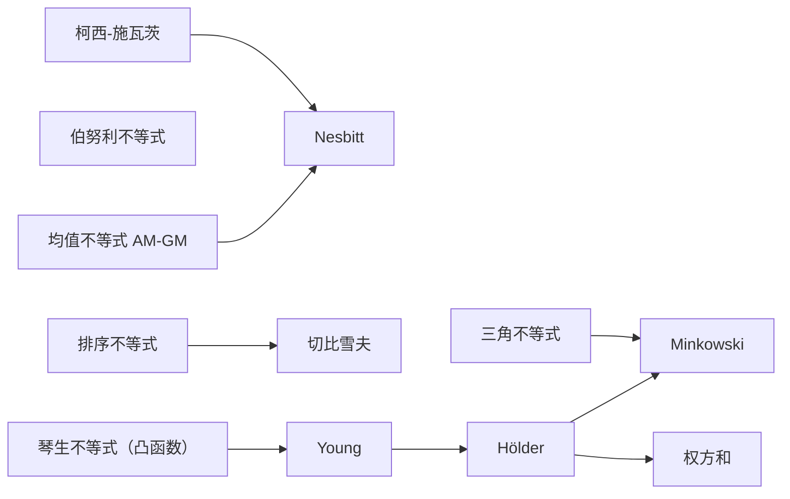

# 不等式

> 本部分按"由浅入深"的学习顺序组织，每个不等式都标出**前驱知识**。
> 建议完成第1部分（基础概念）和高数第2章（导数与微分）后开始学习。

## 全文导航

**依赖关系图**（箭头方向 = 前驱 $\to$ 后继，例如"切比雪夫由排序不等式推出"）：

**目录**：

- [一、基础不等式](#一基础不等式)：三角不等式 · 均值不等式 · 伯努利 · 排序不等式 · 切比雪夫
- [二、核心工具不等式](#二核心工具不等式)：柯西-施瓦茨 · 琴生 · Nesbitt
- [三、高阶不等式](#三高阶不等式)：Young → Hölder → 权方和 / Minkowski（递推链）
- [四、专门应用不等式](#四专门应用不等式)：指数与对数 · 三角函数
- [五、积分形式](#五积分形式)：柯西-施瓦茨 · 琴生
- [六、多视角理解：向量·矩阵·几何·物理](#六多视角理解向量矩阵几何物理)：每个不等式的直观透镜与一句话本质

## 一、基础不等式

> 🎯 **起点**：这一组不等式不依赖其他工具，公式直观、证明初等，是后续所有不等式的基石。

### 三角不等式（绝对值不等式）

> **定理** 对任意实数 $a, b$：
> $$
> |a+b| \le |a| + |b|, \quad \bigl||a| - |b|\bigr| \le |a-b|
> $$
> 等号成立条件：$|a+b| = |a|+|b|$ 当且仅当 $ab \ge 0$；$\bigl||a|-|b|\bigr| = |a-b|$ 当且仅当 $ab \ge 0$（含 $a=b=0$ 的平凡情形）。

**含义**：数轴上"直达不绕行"——从原点直接走到 $a+b$，永远不会比先走到 $a$、再走一段 $b$ 更远；第二条则是"绕行只会更远"的反向表述。

**证明**：

对第一个不等式：
$$
|a+b|^2 = (a+b)^2 = a^2 + 2ab + b^2 \le a^2 + 2|ab| + b^2 = (|a|+|b|)^2
$$
两边开方即得 $|a+b| \le |a|+|b|$。等号成立 $\Leftrightarrow ab = |ab| \Leftrightarrow ab \ge 0$。

对第二个不等式，在第一个中令 $a = x-y$, $b = y$，则 $|x| \le |x-y| + |y|$，即 $|x| - |y| \le |x-y|$。交换 $x,y$ 得 $|y| - |x| \le |y-x| = |x-y|$。合并即 $\bigl||x|-|y|\bigr| \le |x-y|$。$\blacksquare$

> **推广**（三角不等式）：对任意实数 $a_1, a_2, \ldots, a_n$，
> $$
> \left|\sum_{i=1}^n a_i\right| \le \sum_{i=1}^n |a_i|
> $$
> 等号成立当且仅当所有 $a_i$ 同号（全非负或全非正）。

---

### 均值不等式

> **定理（AM-GM）** 对任意非负实数 $a_1, a_2, \ldots, a_n \ge 0$，
> $$
> \sqrt[n]{a_1 a_2 \cdots a_n} \le \frac{a_1 + a_2 + \cdots + a_n}{n}
> $$
> 等号成立当且仅当 $a_1 = a_2 = \cdots = a_n$。

**含义**：几何平均 $\le$ 算术平均。
例如 $a_1=1, a_2=4$：$\sqrt{1\cdot 4}=2 \le \dfrac{1+4}{2}=2.5$。

**证明（Cauchy 前向-后向归纳法）**：

*基例*：$n=1$ 平凡；$n=2$ 由 $(a_1-a_2)^2 \ge 0 \Rightarrow (a_1+a_2)^2 \ge 4a_1a_2$，两边开方即得。

*前向步*（$n = 2^{k-1} \Rightarrow n = 2^k$）：
记 $S_1 = a_1+\cdots+a_{2^{k-1}}$, $S_2 = a_{2^{k-1}+1}+\cdots+a_{2^k}$。由归纳假设
$$
A_1 = \sqrt[2^{k-1}]{a_1 \cdots a_{2^{k-1}}} \le \frac{S_1}{2^{k-1}}, \quad A_2 \le \frac{S_2}{2^{k-1}}
$$
再用 $n=2$ 情形：
$$
\sqrt[2^k]{a_1 \cdots a_{2^k}} = \sqrt{A_1 A_2} \le \frac{A_1+A_2}{2} \le \frac{S_1+S_2}{2^k} = \frac{a_1+\cdots+a_{2^k}}{2^k}
$$

*后向步*（$2^k < n < 2^{k+1}$）：
设 $\bar a = \dfrac{a_1+\cdots+a_n}{n}$，补充 $m = 2^{k+1}-n$ 个 $\bar a$，得到 $2^{k+1}$ 个数。由前向步
$$
\sqrt[2^{k+1}]{a_1 \cdots a_n \cdot \bar a^{m}} \le \frac{a_1+\cdots+a_n + m\bar a}{2^{k+1}} = \frac{n\bar a + m\bar a}{2^{k+1}} = \bar a
$$
两边同时取 $2^{k+1}$ 次幂：
$$
a_1 \cdots a_n \cdot \bar a^{m} \le \bar a^{2^{k+1}}
$$
若 $\bar a = 0$，则所有 $a_i = 0$，不等式显然成立；若 $\bar a > 0$，两边同除以 $\bar a^{m}$：
$$
a_1 \cdots a_n \le \bar a^{n}
$$
再取 $n$ 次算术根，即得
$$
\sqrt[n]{a_1 \cdots a_n} \le \bar a = \frac{a_1+\cdots+a_n}{n}
$$

*等号条件*：在前向步中，等号成立要求两组各自等号成立且 $A_1 = A_2$；在后向步中，等号成立要求所有 $2^{k+1}$ 个数相等，即补充的 $\bar a$ 与原来的 $a_i$ 都相等，故 $a_1 = a_2 = \cdots = a_n = \bar a$。$\blacksquare$

---

### 伯努利不等式

> **定理（Bernoulli）** 对实数 $x > -1$ 和整数 $r \ge 1$，
> $$
> (1+x)^r \ge 1 + rx
> $$
> 等号成立当且仅当 $r=1$ 或 $x=0$。
>
> 更一般地，若 $r \ge 1$ 或 $r \le 0$ 且 $x > -1$，则 $(1+x)^r \ge 1+rx$；若 $0 < r < 1$ 且 $x > -1$，则 $(1+x)^r \le 1+rx$。

**含义**：复利下界——以利率 $x$ 复利 $r$ 期的实际值 $(1+x)^r$ 不低于单利 $1+rx$；也是 $(1+x)^r$ 在 $x=0$ 处切线 $1+rx$ 下方的凸性刻画。

**证明一（数学归纳法，整数情形）**：

*基例* $r=1$：$(1+x)^1 = 1+x$，等号成立。

*归纳假设*：假设对任意实数 $x > -1$，有 $(1+x)^k \ge 1+kx$ 成立。

*归纳步* $r=k+1$：
$$
\begin{aligned}
(1+x)^{k+1} &= (1+x)^k (1+x) \\
&\ge (1+kx)(1+x) \quad \text{（由归纳假设且 } 1+x > 0\text{）} \\
&= 1 + (k+1)x + kx^2 \\
&\ge 1 + (k+1)x
\end{aligned}
$$
最后一步因为 $kx^2 \ge 0$。$\blacksquare$

**证明二（微分法，实数情形）**：

设 $f(x) = (1+x)^r - (1+rx)$，$x > -1$。求导：
$$
f'(x) = r(1+x)^{r-1} - r = r\left[(1+x)^{r-1} - 1\right]
$$

- 当 $r > 1$ 且 $x > 0$ 时，$(1+x)^{r-1} > 1$，故 $f'(x) > 0$；当 $-1 < x < 0$ 时，$f'(x) < 0$。所以 $x=0$ 是极小值点，$f(x) \ge f(0) = 0$。
- 当 $0 < r < 1$ 时，$x=0$ 是极大值点，$f(x) \le f(0) = 0$。
- 当 $r < 0$ 时，分析类似 $r > 1$ 的情形，$f(x) \ge 0$。

$\blacksquare$

---

### 排序不等式

> **定理** 设 $a_1 \le a_2 \le \cdots \le a_n$ 和 $b_1 \le b_2 \le \cdots \le b_n$ 是两组实数。
> 对于 $\{1,2,\ldots,n\}$ 的任意排列 $\sigma$，有
> $$
> \sum_{i=1}^n a_i b_{n+1-i} \le \sum_{i=1}^n a_i b_{\sigma(i)} \le \sum_{i=1}^n a_i b_i
> $$
> 即：**逆序和 $\le$ 乱序和 $\le$ 同序和**。
>
> 等号条件：**对任意排列 $\sigma$ 乱序和都等于同序和**，当且仅当所有 $a_i$ 相等或所有 $b_i$ 相等；对**给定**的排列 $\sigma$，等号成立当且仅当 $\sigma$ 的每一对乱序位置（$i < j$ 但 $\sigma(i) > \sigma(j)$）都满足 $a_i = a_j$ 或 $b_{\sigma(i)} = b_{\sigma(j)}$（见证明末尾的反例）。

**含义**：两组有序数列，对应位置相乘再求和，当顺序一致时和最大，顺序相反时和最小。

**证明（交换法）**：

只证右侧不等式（同序和最大），左侧类似。

设 $S = \sum_{i=1}^n a_i b_{\sigma(i)}$ 是某个乱序和。如果 $\sigma$ 不是恒等排列，则存在 $i < j$ 使得 $\sigma(i) > \sigma(j)$。考虑交换这两个位置：

令 $\sigma'$ 为将 $\sigma(i)$ 与 $\sigma(j)$ 交换后的排列，比较两者的贡献差：
$$
\begin{aligned}
&\left[a_i b_{\sigma(i)} + a_j b_{\sigma(j)}\right] - \left[a_i b_{\sigma(j)} + a_j b_{\sigma(i)}\right] \\
=&\; a_i(b_{\sigma(i)} - b_{\sigma(j)}) + a_j(b_{\sigma(j)} - b_{\sigma(i)}) \\
=&\; (a_i - a_j)(b_{\sigma(i)} - b_{\sigma(j)}) \le 0
\end{aligned}
$$

因为 $i < j$ 有 $a_i \le a_j$，且 $\sigma(i) > \sigma(j)$ 有 $b_{\sigma(i)} \ge b_{\sigma(j)}$，所以乘积非正。即交换后和不减：
$$
\sum_{i=1}^n a_i b_{\sigma(i)} \le \sum_{i=1}^n a_i b_{\sigma'(i)}
$$

重复此交换操作，每次减少逆序对数，最终得到恒等排列（同序），即证。

等号条件：若所有 $a_i$ 相等或所有 $b_i$ 相等，则上述差值恒为 $0$，任何排列的和都相同。反之，若等号对给定的排列 $\sigma$ 成立，则消尽 $\sigma$ 全部逆序对的每一步交换差值都必须为 $0$，即每对乱序位置 $(i,j)$ 满足 $a_i = a_j$ 或 $b_{\sigma(i)} = b_{\sigma(j)}$——注意这**不要求**所有 $a_i$ 或所有 $b_i$ 全相等：例如 $a = (1,1,2)$、$b = (1,2,3)$ 时，交换前两个位置（它们的 $a$ 值相等）不改变和，故该排列取等。只有当要求**对任意排列**都取等时，才必须所有 $a_i$ 相等或所有 $b_i$ 相等。$\blacksquare$

---

### 切比雪夫不等式

> **前驱**：排序不等式
>
> **定理（Chebyshev）** 设 $a_1 \le a_2 \le \cdots \le a_n$ 和 $b_1 \le b_2 \le \cdots \le b_n$ 是同序的两组实数，则
> $$
> \frac{a_1 + a_2 + \cdots + a_n}{n} \cdot \frac{b_1 + b_2 + \cdots + b_n}{n} \le \frac{a_1 b_1 + a_2 b_2 + \cdots + a_n b_n}{n}
> $$
> 即：**同序时，算术平均的乘积 $\le$ 乘积的算术平均**。
>
> 若两组数反序（一组增一组减），则不等号反向。

**证明（由排序不等式）**：

由排序不等式，同序和最大。对 $k=1,2,\ldots,n$，记 $b_{i}^{(k)} = b_{i+k}$（循环移位，$b_{n+j} = b_j$）。循环移位是 $\{1,\ldots,n\}$ 上的一个排列 $\sigma_k$，对任意排列排序不等式均成立，故对每个 $k$：
$$
\sum_{i=1}^n a_i b_{i+k} = \sum_{i=1}^n a_i b_{\sigma_k(i)} \le \sum_{i=1}^n a_i b_i
$$

将 $n$ 个这样的不等式相加（$k=0,1,\ldots,n-1$）：
$$
\sum_{k=0}^{n-1} \sum_{i=1}^n a_i b_{i+k} \le n \sum_{i=1}^n a_i b_i
$$

左边每个 $b_j$ 恰好出现 $n$ 次，所以：
$$
\sum_{i=1}^n a_i \cdot \sum_{j=1}^n b_j = \sum_{k=0}^{n-1} \sum_{i=1}^n a_i b_{i+k} \le n \sum_{i=1}^n a_i b_i
$$

两边除以 $n^2$ 即得：
$$
\frac{\sum a_i}{n} \cdot \frac{\sum b_i}{n} \le \frac{\sum a_i b_i}{n}
$$

$\blacksquare$

> **思路二：配对作差法（直接证法，不依赖排序不等式）**
>
> 核心观察：$a,b$ 同序 $\Longleftrightarrow$ 对任意 $i,j$ 都有 $(a_i - a_j)(b_i - b_j) \ge 0$。
>
> 把所有这样的"协方差"对求和：
> $$
> S = \sum_{i=1}^{n}\sum_{j=1}^{n}(a_i - a_j)(b_i - b_j) \ge 0
> $$
>
> 展开 $S$（注意 $i,j$ 各自独立地从 $1$ 跑到 $n$）：
> $$
> S = \sum_{i,j}(a_i b_i - a_i b_j - a_j b_i + a_j b_j) = 2n\sum_{i=1}^{n} a_i b_i - 2\Big(\sum_{i=1}^{n} a_i\Big)\Big(\sum_{j=1}^{n} b_j\Big) \ge 0
> $$
>
> 移项即得：
> $$
> \Big(\sum a_i\Big)\Big(\sum b_j\Big) \le n \sum a_i b_i
> $$
>
> 两边除以 $n^2$，与原式完全一致。$\blacksquare$
>
> **两种证法对比**：
>
> | 证法 | 思路 | 依赖 | 适合场景 |
> |:---:|:---|:---|:---|
> | 思路一 | 循环移位 + 排序不等式求和 | 排序不等式 | 已经证过排序不等式时，最快 |
> | 思路二 | 配对作差 $(a_i-a_j)(b_i-b_j)\ge 0$ | 无（仅用同序定义） | 自包含讲法、强调几何直观 |

### 几何直观

切比雪夫不等式其实就是 **"同方向变化的两个量,它们的乘积被加权放大"**。下面从三个角度把它说透。

#### 1. 散点图视角（最直观）

把 $n$ 对数据 $(a_i, b_i)$ 画到二维平面上：

同序时点云"从左下爬到右上"，大 $a$ 配大 $b$；反序时"从左上落到右下"，大 $a$ 配小 $b$；散乱时无固定趋势。

切比雪夫说的就是:**点云正相关时,乘积的均值 ≥ 均值的乘积**——这正是样本协方差 $\text{Cov}(a,b)\ge 0$。

#### 2. 重心/加权视角

- $\bar a$ 是 $a$ 的"重心"（质量均匀时的平衡点）
- $\bar b$ 同理
- $\bar a\cdot \bar b$ = 两个重心分别相乘（"先求平均再乘"）
- $\overline{ab}$ = "先乘再求平均"

**同序时,大 $a$ 总是配大 $b$,乘积 $a_i b_i$ 整体被"加权抬升"**;反序时则被"加权压低"。这就是 $\overline{ab}$ 与 $\bar a \bar b$ 偏差的几何含义。

#### 3. 协方差非负性（代数本质）

把切比雪夫改写一下:
$$
\underbrace{\overline{ab} - \bar a \bar b}_{\text{协方差}} = \frac{1}{2n^2}\sum_{i=1}^{n}\sum_{j=1}^{n}(a_i - a_j)(b_i - b_j) \ge 0
$$

最后一行的恒等式正好就是"配对作差"那个证法的核心——**同序 $\Longleftrightarrow$ 所有差分对 $(a_i-a_j)(b_i-b_j)\ge 0$**。所以两个证法其实是同一个直觉的不同写法。

> **一句话记忆**：切比雪夫 = **同序 ⟹ 协方差非负** = **正相关时,期望的乘积 $\le$ 乘积的期望**。

---

## 二、核心工具不等式

> 🎯 **进阶**：这一组是考研和竞赛中最常考、最常用的不等式工具，必须熟练掌握。

### 柯西-施瓦茨不等式

> **定理（Cauchy-Schwarz）** 对任意实数 $a_1, \ldots, a_n$ 和 $b_1, \ldots, b_n$，
> $$
> \left(\sum_{i=1}^n a_i b_i\right)^2 \le \left(\sum_{i=1}^n a_i^2\right)\left(\sum_{i=1}^n b_i^2\right)
> $$
> 等号成立当且仅当 $a_i = \lambda b_i$（对某个常数 $\lambda$，所有 $i$）或 $b_i$ 全为 $0$。

**含义**：两个向量的点积的平方不超过它们模长平方的乘积，即 $|\vec{a} \cdot \vec{b}|^2 \le |\vec{a}|^2 |\vec{b}|^2$。

几何上，$\vec{a}\cdot\vec{b} = |\vec{a}||\vec{b}|\cos\theta$，而投影长度 $|\vec{b}||\cos\theta| \le |\vec{b}|$，所以点积的绝对值被两个模长之积"卡住"；夹角越小（越平行）越接近等号。

**证明一（判别式法）**：

若所有 $b_i = 0$，不等式两边均为 $0$，显然成立。

设 $b_1, \ldots, b_n$ 不全为 $0$，考虑关于 $t$ 的二次函数：
$$
f(t) = \sum_{i=1}^n (a_i - t b_i)^2 = \sum_{i=1}^n a_i^2 - 2t \sum_{i=1}^n a_i b_i + t^2 \sum_{i=1}^n b_i^2
$$

由于 $f(t) \ge 0$ 对所有实数 $t$ 成立，且 $\sum b_i^2 > 0$，故该二次函数的判别式 $\Delta \le 0$：
$$
\Delta = 4\left(\sum_{i=1}^n a_i b_i\right)^2 - 4\left(\sum_{i=1}^n a_i^2\right)\left(\sum_{i=1}^n b_i^2\right) \le 0
$$

即
$$
\left(\sum_{i=1}^n a_i b_i\right)^2 \le \left(\sum_{i=1}^n a_i^2\right)\left(\sum_{i=1}^n b_i^2\right)
$$

等号成立 $\Leftrightarrow \Delta = 0 \Leftrightarrow$ 存在 $t$ 使得 $f(t) = 0$，即 $a_i = t b_i$ 对所有 $i$ 成立。$\blacksquare$

**证明二（Lagrange 恒等式）**：

$$
\left(\sum_{i=1}^n a_i^2\right)\left(\sum_{j=1}^n b_j^2\right) - \left(\sum_{i=1}^n a_i b_i\right)^2 = \sum_{1 \le i < j \le n} (a_i b_j - a_j b_i)^2 \ge 0
$$

等号成立当且仅当所有 $a_i b_j = a_j b_i$，即 $a_i = \lambda b_i$。$\blacksquare$

---

#### 附：Lagrange 恒等式详解

Lagrange 恒等式不仅证明了 Cauchy-Schwarz 不等式，还**精确量化了等号两边的差距**。

> **恒等式**：
> $$
> \left(\sum_{i=1}^n a_i^2\right)\left(\sum_{j=1}^n b_j^2\right) - \left(\sum_{i=1}^n a_i b_i\right)^2 = \sum_{1 \le i < j \le n} (a_i b_j - a_j b_i)^2
> $$

**为什么右边是 $\binom{n}{2}$ 个平方项？**

左边展开时，交叉项 $a_i^2 b_j^2 + a_j^2 b_i^2 - 2 a_i b_i a_j b_j$ 恰好凑成完全平方：

$$
(a_i b_j)^2 + (a_j b_i)^2 - 2(a_i b_i)(a_j b_j) = (a_i b_j - a_j b_i)^2
$$

所有非平方项（即 $i=j$ 的项 $a_i^2 b_i^2$）在左右两边恰好抵消，剩下的就只有这些 $2 \times 2$ 子行列式的平方。

**低维验证**：

- $n=2$：$(a_1^2+a_2^2)(b_1^2+b_2^2) - (a_1b_1+a_2b_2)^2 = (a_1b_2-a_2b_1)^2$
  这正是向量 $(a_1,a_2)$ 与 $(b_1,b_2)$ 张成的平行四边形**面积的平方**。

- $n=3$：差距为三个投影面积平方之和：
  $$
  (a_1b_2-a_2b_1)^2 + (a_2b_3-a_3b_2)^2 + (a_3b_1-a_1b_3)^2
  $$

**几何意义**：对向量 $\vec{a}, \vec{b} \in \mathbb{R}^n$，

$$
|\vec{a}|^2 |\vec{b}|^2 - (\vec{a}\cdot\vec{b})^2 = \sum_{i<j}(a_i b_j - a_j b_i)^2 = \det G(\vec{a},\vec{b})
$$

其中 $G(\vec{a},\vec{b})$ 是 $\vec{a}, \vec{b}$ 组成的 Gram 矩阵。**当 $n=3$ 时**，这个和式恰好等于 $|\vec{a}\times\vec{b}|^2$（二维子式正是叉积分量的平方）；对一般的 $n$，没有标准的"叉积"概念，但这个和式仍然是 $|\vec{a}|^2|\vec{b}|^2(1-\cos^2\theta) = |\vec{a}|^2|\vec{b}|^2\sin^2\theta$ 的代数精确表达。Cauchy-Schwarz 只是它 $\ge 0$ 的平凡推论。$\blacksquare$

#### Lagrange 恒等式的完整推导

上面"详解"里讲了**是什么**和**意味着什么**,这里给出**怎么证**——把左边的双重求和一步步展开,凑出右边的 $\binom{n}{2}$ 个平方项。

**目标**:
$$
\underbrace{\left(\sum_{i=1}^{n} a_i^{2}\right)\left(\sum_{j=1}^{n} b_j^{2}\right)}_{L} - \underbrace{\left(\sum_{i=1}^{n} a_i b_i\right)^{2}}_{R} \stackrel{?}{=} \sum_{1 \le i < j \le n}(a_i b_j - a_j b_i)^{2}
$$

**步骤 1:把 $L$ 和 $R$ 都写成双重求和**

$L$ 拆对角线项 + 非对角线项:
$$
L = \sum_{i,j} a_i^{2} b_j^{2} = \underbrace{\sum_{i} a_i^{2} b_i^{2}}_{\text{对角}(i=j)} + \underbrace{\sum_{i \neq j} a_i^{2} b_j^{2}}_{\text{非对角}}
$$

$R$ 同样拆:
$$
R = \sum_{i,j} a_i b_i \cdot a_j b_j = \sum_{i} a_i^{2} b_i^{2} + \sum_{i \neq j} a_i b_i a_j b_j
$$

**步骤 2:$L - R$,对角线项自动抵消**
$$
L - R = \sum_{i \neq j} a_i^{2} b_j^{2} - \sum_{i \neq j} a_i b_i a_j b_j = \sum_{i \neq j}\big(a_i^{2} b_j^{2} - a_i b_i a_j b_j\big)
$$

**步骤 3:对每对 $(i,j)$ 和 $(j,i)$ 配对** (关键一步!)

非对角求和里,$(i,j)$ 和 $(j,i)$ (其中 $i<j$) 贡献合起来:
$$
\big(a_i^{2} b_j^{2} - a_i b_i a_j b_j\big) + \big(a_j^{2} b_i^{2} - a_j b_j a_i b_i\big) = a_i^{2} b_j^{2} + a_j^{2} b_i^{2} - 2 a_i b_i a_j b_j
$$

**正好是完全平方** $(a_i b_j - a_j b_i)^{2}$!

**步骤 4:配对求和即得**
$$
L - R = \sum_{i < j}\big[(a_i b_j - a_j b_i)^{2}\big] \quad \blacksquare
$$

> **小诀窍**:这个证明唯一的技术是"把 $i \neq j$ 拆成 $i<j$ 和 $i>j$ 两半,再配对合并"——记下"配对 $(i,j)/(j,i)$"这个动作,以后推导 Gram 行列式、Plücker 关系时还会反复用到。

#### 矩阵视角(一眼看清结构)

记 $A=(a_1,\ldots,a_n)$,$B=(b_1,\ldots,b_n)$ 为行向量。Lagrange 恒等式可重写为:
$$
\det \begin{pmatrix} A A^{\top} & A B^{\top} \\ B A^{\top} & B B^{\top} \end{pmatrix} = \sum_{i<j}(a_i b_j - a_j b_i)^{2}
$$

左边是 Gram 矩阵的行列式;右边是"外积 $A \wedge B$ 的模方"。这正是 Grassmann 外代数的种子——所以这个恒等式**不只是 Cauchy-Schwarz 的工具,它是现代多重线性代数的开端**。

#### 历史小注(为什么叫 Lagrange 恒等式)

- **1773, Lagrange**:在研究二次型判别式时,首次明确写出这个恒等式。
- **1821, Cauchy**:用它推出 Cauchy-Schwarz 不等式 (即 $\Delta \le 0$ 的推论)。
- **1844, Grassmann**:把它放进外代数的框架,认识到 $a_i b_j - a_j b_i$ 正是 $\vec{a}\wedge\vec{b}$ 的坐标 —— **多重线性代数的起点**。

> **考研定位**:Lagrange 恒等式本身不直接命题,但它是 **Cauchy-Schwarz 的代数根** + **行列式与向量夹角的桥梁**。掌握它,看到"证 Cauchy-Schwarz"或"求两向量夹角"的题目,你就多一条"用恒等式改写"的解题路径。

---

### 琴生不等式

> **前驱**：凸函数定义
>
> **定理（Jensen）** 设 $f$ 是区间 $I$ 上的凸函数，$x_1, \ldots, x_n \in I$，$\lambda_1, \ldots, \lambda_n > 0$ 且 $\sum \lambda_i = 1$，则
> $$
> f\left(\sum_{i=1}^n \lambda_i x_i\right) \le \sum_{i=1}^n \lambda_i f(x_i)
> $$
> 等号成立条件：若 $f$ 严格凸，则当且仅当 $x_1 = x_2 = \cdots = x_n$；若 $f$ 仅凸（非严格），存在其他取等情形（例如 $f(x)=|x|$，$\lambda_1=\lambda_2=1/2$，$x_1=-x_2$）。
>
> 若 $f$ 是凹函数，则不等号反向：$f\left(\sum \lambda_i x_i\right) \ge \sum \lambda_i f(x_i)$。

**含义**：凸函数在加权平均点处的值不超过函数值的加权平均。直观图景就是"**弦在曲线上方**"：

图中加权点 $\lambda x_1+(1-\lambda)x_2$ 处，曲线上的点（红）始终不高于弦上的点（紫）。

**证明（数学归纳法）**：

*基例* $n=2$：由凸函数定义，对任意 $x_1, x_2 \in I$ 和 $\lambda \in (0,1)$，
$$
f(\lambda x_1 + (1-\lambda) x_2) \le \lambda f(x_1) + (1-\lambda) f(x_2)
$$
这正是 $n=2$ 的琴生不等式。

*归纳假设*：假设对 $n=k$ 成立，即对任意 $y_1, \ldots, y_k \in I$ 和满足 $\sum_{i=1}^k \alpha_i = 1$ 的正权重 $\alpha_i$，有
$$
f\left(\sum_{i=1}^k \alpha_i y_i\right) \le \sum_{i=1}^k \alpha_i f(y_i)
$$

*归纳步* $n=k+1$：设 $x_1, \ldots, x_{k+1} \in I$，$\lambda_1, \ldots, \lambda_{k+1} > 0$ 且 $\sum_{i=1}^{k+1} \lambda_i = 1$。

令 $S = \sum_{i=1}^k \lambda_i = 1 - \lambda_{k+1}$，并定义 $\mu_i = \lambda_i / S$（$i=1, \ldots, k$），则 $\sum_{i=1}^k \mu_i = 1$。

记 $y = \sum_{i=1}^k \mu_i x_i$。由凸函数定义（$n=2$ 情形）：
$$
f\left(\sum_{i=1}^{k+1} \lambda_i x_i\right) = f\left(S \cdot y + \lambda_{k+1} \cdot x_{k+1}\right) \le S \cdot f(y) + \lambda_{k+1} f(x_{k+1})
$$

再由归纳假设（取 $y_i = x_i,\; \alpha_i = \mu_i$）：
$$
f(y) = f\left(\sum_{i=1}^k \mu_i x_i\right) \le \sum_{i=1}^k \mu_i f(x_i)
$$

代入上式得：
$$
\begin{aligned}
f\left(\sum_{i=1}^{k+1} \lambda_i x_i\right) &\le S \cdot \sum_{i=1}^k \mu_i f(x_i) + \lambda_{k+1} f(x_{k+1}) \\
&= \sum_{i=1}^k \lambda_i f(x_i) + \lambda_{k+1} f(x_{k+1}) \\
&= \sum_{i=1}^{k+1} \lambda_i f(x_i)
\end{aligned}
$$

等号条件：对严格凸函数，要求归纳假设中的取等号，即 $x_1 = \cdots = x_k = y$；同时要求凸函数定义中的取等号，即 $y = x_{k+1}$。故所有 $x_i$ 相等。$\blacksquare$

**推论（算术平均 $\le$ 均方根）**：
取 $f(x) = x^2$（凸函数），$\lambda_i = 1/n$，得
$$
\left(\frac{a_1 + \cdots + a_n}{n}\right)^2 \le \frac{a_1^2 + \cdots + a_n^2}{n}
$$
即
$$
\frac{a_1 + \cdots + a_n}{n} \le \sqrt{\frac{a_1^2 + \cdots + a_n^2}{n}}
$$

---

#### 附：凸函数与凹函数的判定

**几何直观**：函数 $f$ 是**凸函数** $\Leftrightarrow$ 函数图像上任意两点间的弦总在该两点间函数图像的**上方**（或重合）。直观地说，图像"向上鼓"。

> **定义**（凸函数）：设 $f$ 在区间 $I$ 上有定义，若对任意 $x_1, x_2 \in I$ 和任意 $\lambda \in [0,1]$，有
> $$
> f(\lambda x_1 + (1-\lambda) x_2) \le \lambda f(x_1) + (1-\lambda) f(x_2)
> $$
> 则称 $f$ 为 $I$ 上的**凸函数**。若不等号严格成立（$x_1 \neq x_2$ 且 $0 < \lambda < 1$），则称 $f$ 为**严格凸函数**。

**凹函数**则是相反的概念：弦总在图像**下方**，图像"向下鼓"。定义中不等号反向即可。

**等价判定方法（考研常用）**：

| 方法 | 条件 | 结论 |
|------|------|------|
| **一阶导数法** | $f'(x)$ 在 $I$ 上单调递增 | $f$ 是凸函数 |
| **二阶导数法** | $f''(x) \ge 0$ 对所有 $x \in I$ | $f$ 是凸函数 |
| **严格凸** | $f''(x) > 0$ | $f$ 是严格凸函数 |

对凹函数，上述条件反向：$f'(x)$ 单调递减 $\Leftrightarrow$ $f''(x) \le 0$。

**常见凸函数例子**：
- $f(x) = x^2$（$f''(x) = 2 > 0$）
- $f(x) = e^x$（$f''(x) = e^x > 0$）
- $f(x) = -\ln x$（$x > 0$，$f''(x) = \frac{1}{x^2} > 0$）
- $f(x) = |x|^p$（$p \ge 1$）

**常见凹函数例子**：
- $f(x) = \ln x$（$x > 0$，$f''(x) = -\frac{1}{x^2} < 0$）
- $f(x) = \sqrt{x}$（$x > 0$，$f''(x) = -\frac{1}{4}x^{-3/2} < 0$）
- $f(x) = \sin x$（在 $[0, \pi]$ 上）

**重要关系**：若 $f$ 是凸函数，则 $-f$ 是凹函数；反之亦然。因此只需记住凸函数的结论，凹函数的不等号反向即可。

---

### Nesbitt 不等式

> **前驱**：柯西-施瓦茨、AM-GM
>
> **定理（Nesbitt）** 对任意正实数 $a,b,c$，
> $$
> \frac{a}{b+c} + \frac{b}{c+a} + \frac{c}{a+b} \ge \frac{3}{2}
> $$
> 等号成立当且仅当 $a=b=c$。

**证明一（对称换元）**：

令 $x = b+c$，$y = c+a$，$z = a+b$，则 $a = \frac{y+z-x}{2}$，$b = \frac{z+x-y}{2}$，$c = \frac{x+y-z}{2}$。由三角形不等式知 $x,y,z > 0$ 且可构成三角形三边。

原式变为：
$$
\sum_{cyc} \frac{y+z-x}{2x} = \frac{1}{2}\sum_{cyc}\left(\frac{y}{x} + \frac{z}{x} - 1\right) = \frac{1}{2}\left(\frac{y}{x}+\frac{z}{x}+\frac{z}{y}+\frac{x}{y}+\frac{x}{z}+\frac{y}{z} - 3\right)
$$

由 AM-GM，$\frac{y}{x}+\frac{x}{y} \ge 2$ 等，故上式
$$
\ge \frac{1}{2}(2+2+2-3) = \frac{3}{2}
$$

$\blacksquare$

**证明二（Cauchy-Schwarz / Titu 引理）**：

$$
\sum_{cyc} \frac{a}{b+c} = \sum_{cyc} \frac{a^2}{a(b+c)} \ge \frac{(a+b+c)^2}{a(b+c)+b(c+a)+c(a+b)} = \frac{(a+b+c)^2}{2(ab+bc+ca)}
$$

只需证 $\dfrac{(a+b+c)^2}{2(ab+bc+ca)} \ge \dfrac{3}{2}$，即 $(a+b+c)^2 \ge 3(ab+bc+ca)$，展开即 $a^2+b^2+c^2 \ge ab+bc+ca$，这是显然的（$\Leftrightarrow \frac{1}{2}[(a-b)^2+(b-c)^2+(c-a)^2] \ge 0$）。$\blacksquare$

---

## 三、高阶不等式

> 🎯 **拔高**：这一组是 Young → Hölder → 权方和/Minkowski 的递推链，相互依赖。
> 考研大纲对 Young/Hölder 较陌生，但竞赛中常考，建议理解为主。

### Young 不等式

> **前驱**：琴生不等式（用 $e^x$ 的凸性）
>
> **定理（Young）** 设 $a,b \ge 0$，$p > 1$，$q > 1$ 且 $\dfrac{1}{p} + \dfrac{1}{q} = 1$，则
> $$
> ab \le \frac{a^p}{p} + \frac{b^q}{q}
> $$
> 等号成立当且仅当 $a^p = b^q$。

**含义**：Young 是 AM-GM 的推广（$p=q=2$ 时即为 $\displaystyle ab \le \frac{a^2+b^2}{2}$）。

**证明（凸函数法）**：

当 $a=0$ 或 $b=0$ 时，左侧为 $0$、右侧 $\ge 0$，不等式显然成立。故不妨设 $a, b > 0$。

考虑函数 $f(x) = e^x$（严格凸函数）。由 Jensen 不等式或直接用凸函数定义：
$$
ab = e^{\ln a + \ln b} = e^{\frac{1}{p}\cdot p\ln a + \frac{1}{q}\cdot q\ln b} \le \frac{1}{p}e^{p\ln a} + \frac{1}{q}e^{q\ln b} = \frac{a^p}{p} + \frac{b^q}{q}
$$

等号成立当且仅当 $p\ln a = q\ln b$，即 $a^p = b^q$。$\blacksquare$

**证明二（积分法）**：

设 $f(t) = t^{p-1}$，其反函数为 $f^{-1}(s) = s^{1/(p-1)} = s^{q-1}$（因为 $\frac{1}{p}+\frac{1}{q}=1$ 推出 $(p-1)(q-1)=1$）。由 Young 积分不等式（凸函数图像下的面积关系）：
$$
ab \le \int_0^a t^{p-1}\,dt + \int_0^b s^{q-1}\,ds = \frac{a^p}{p} + \frac{b^q}{q}
$$

上图的直观：曲线 $y = x^{p-1}$ 把第一象限切成两半，蓝色（$[0,a]$ 上曲线下方）与橙色（$[0,b]$ 上曲线左方）两块面积之和不小于矩形 $[0,a]\times[0,b]$ 的面积 $ab$——点 $(a,b)$ 离曲线越远，富余越多；恰在曲线上时两面积之和正好等于 $ab$（等号条件）。

$\blacksquare$

---

### Hölder 不等式

> **前驱**：Young 不等式
>
> **定理（Hölder）** 设 $p > 1$，$q > 1$ 且 $\dfrac{1}{p} + \dfrac{1}{q} = 1$（称 $p,q$ 为共轭指数），对任意非负实数 $a_i, b_i$（$i=1,\ldots,n$），有
> $$
> \sum_{i=1}^n a_i b_i \le \left(\sum_{i=1}^n a_i^p\right)^{1/p} \left(\sum_{i=1}^n b_i^q\right)^{1/q}
> $$
> 等号成立当且仅当 $a_i^p$ 与 $b_i^q$ 成比例，即存在常数 $\lambda$ 使得 $a_i^p = \lambda b_i^q$（$i=1,\ldots,n$）。

**含义**：Hölder 是 Cauchy-Schwarz 的推广（$p=q=2$ 时即为 Cauchy-Schwarz）。

**证明（Young 不等式 + 标准化）**：

先证明一个引理：若 $u_1, \ldots, u_n \ge 0$ 且 $v_1, \ldots, v_n \ge 0$ 满足 $\sum_{i=1}^n u_i^p = \sum_{i=1}^n v_i^q = 1$，则 $\sum_{i=1}^n u_i v_i \le 1$。

由 Young 不等式（见上节），对每一项：
$$
u_i v_i \le \frac{u_i^p}{p} + \frac{v_i^q}{q}
$$

求和得：
$$
\sum_{i=1}^n u_i v_i \le \frac{1}{p}\sum_{i=1}^n u_i^p + \frac{1}{q}\sum_{i=1}^n v_i^q = \frac{1}{p} + \frac{1}{q} = 1
$$

**一般情形**：令 $A = \left(\sum_{i=1}^n a_i^p\right)^{1/p}$，$B = \left(\sum_{i=1}^n b_i^q\right)^{1/q}$。若 $A=0$ 或 $B=0$，不等式显然成立。否则令 $u_i = a_i/A$，$v_i = b_i/B$（$i=1,\ldots,n$），则 $\sum_{i=1}^n u_i^p = \sum_{i=1}^n v_i^q = 1$，满足引理条件，故：
$$
\sum_{i=1}^n u_i v_i \le 1 \quad \Rightarrow \quad \sum_{i=1}^n \frac{a_i}{A} \cdot \frac{b_i}{B} \le 1 \quad \Rightarrow \quad \sum_{i=1}^n a_i b_i \le AB
$$

$\blacksquare$

**积分形式**：若 $f,g$ 在 $[a,b]$ 上可积，$p,q > 1$ 且 $\frac{1}{p}+\frac{1}{q}=1$，则
$$
\int_a^b |f(x)g(x)|\,dx \le \left(\int_a^b |f(x)|^p\,dx\right)^{1/p} \left(\int_a^b |g(x)|^q\,dx\right)^{1/q}
$$

---

### 权方和不等式

> **前驱**：Hölder 不等式
>
> **定理** 设 $a_i > 0$, $b_i > 0$（$i=1,\ldots,n$），实数 $p > 0$，则
> $$
> \sum_{i=1}^n \frac{a_i^{p+1}}{b_i^p} \ge \frac{\left(\sum_{i=1}^n a_i\right)^{p+1}}{\left(\sum_{i=1}^n b_i\right)^p}
> $$
> 等号成立当且仅当 $\dfrac{a_1}{b_1} = \dfrac{a_2}{b_2} = \cdots = \dfrac{a_n}{b_n}$。

**特例（$p=1$）**：
$$
\sum_{i=1}^n \frac{a_i^2}{b_i} \ge \frac{(a_1 + \cdots + a_n)^2}{b_1 + \cdots + b_n}
$$
这是竞赛中极为常用的形式，可由 Cauchy-Schwarz 直接推出：
$$
\left(\sum \frac{a_i^2}{b_i}\right)\left(\sum b_i\right) \ge \left(\sum a_i\right)^2
$$

**证明（Hölder 不等式特例）**：

权方和不等式是 Hölder 不等式的直接推论。设 $q = p+1$，$r = (p+1)/p$，则 $\dfrac{1}{q} + \dfrac{1}{r} = 1$。由 Hölder 不等式：

$$
\sum_{i=1}^n a_i = \sum_{i=1}^n \frac{a_i}{b_i^{p/(p+1)}} \cdot b_i^{p/(p+1)} \le \left(\sum_{i=1}^n \frac{a_i^{p+1}}{b_i^p}\right)^{1/(p+1)} \cdot \left(\sum_{i=1}^n b_i\right)^{p/(p+1)}
$$

两边取 $(p+1)$ 次幂：

$$
\left(\sum_{i=1}^n a_i\right)^{p+1} \le \left(\sum_{i=1}^n \frac{a_i^{p+1}}{b_i^p}\right) \cdot \left(\sum_{i=1}^n b_i\right)^p
$$

整理即得权方和不等式。等号条件来自 Hölder 的等号条件。$\blacksquare$

---

### Minkowski 不等式

> **前驱**：Hölder 不等式
>
> **定理（Minkowski）** 设 $p \ge 1$，对任意实数 $a_i, b_i$（$i=1,\ldots,n$），有
> $$
> \left(\sum_{i=1}^n |a_i + b_i|^p\right)^{1/p} \le \left(\sum_{i=1}^n |a_i|^p\right)^{1/p} + \left(\sum_{i=1}^n |b_i|^p\right)^{1/p}
> $$
> 等号成立当且仅当 $a_i$ 与 $b_i$ 同号且成比例（或其中一组全为 $0$）。

**含义**：这是三角不等式在 $L^p$ 范数下的推广（$p=2$ 时即欧几里得范数的三角不等式，$p=1$ 时即普通的绝对值三角不等式）。

**证明（Hölder 不等式）**：

当 $p=1$ 时，由 $|a_i+b_i| \le |a_i|+|b_i|$ 求和即得。

设 $p > 1$，记 $q = \frac{p}{p-1}$（即 $\frac{1}{p}+\frac{1}{q}=1$）。令 $S = \sum |a_i+b_i|^p$。

$$
\begin{aligned}
S &= \sum_{i=1}^n |a_i+b_i| \cdot |a_i+b_i|^{p-1} \\
&\le \sum_{i=1}^n |a_i| \cdot |a_i+b_i|^{p-1} + \sum_{i=1}^n |b_i| \cdot |a_i+b_i|^{p-1}
\end{aligned}
$$

对两个求和项分别用 Hölder 不等式（注意 $(p-1)q = p$）：

$$
\sum_{i=1}^n |a_i| \cdot |a_i+b_i|^{p-1} \le \left(\sum |a_i|^p\right)^{1/p} \left(\sum |a_i+b_i|^{(p-1)q}\right)^{1/q} = \left(\sum |a_i|^p\right)^{1/p} \cdot S^{1/q}
$$

同理第二项。于是：
$$
S \le S^{1/q}\left[\left(\sum |a_i|^p\right)^{1/p} + \left(\sum |b_i|^p\right)^{1/p}\right]
$$

若 $S=0$ 不等式显然成立；若 $S>0$，两边除以 $S^{1/q} = S^{1-1/p}$，得 $S^{1/p}$ 不超过右边括号内的和，即证。$\blacksquare$

**积分形式**：
$$
\left(\int_a^b |f(x)+g(x)|^p\,dx\right)^{1/p} \le \left(\int_a^b |f(x)|^p\,dx\right)^{1/p} + \left(\int_a^b |g(x)|^p\,dx\right)^{1/p}
$$

---

## 四、专门应用不等式

> 🎯 **应用**：这一组结合具体函数类型，在求极限、证明等式/不等式中经常出现。

### 指数与对数不等式

#### 基本指数不等式

> **定理** 对任意实数 $x$，
> $$
> e^x \ge 1 + x
> $$
> 等号成立当且仅当 $x=0$。

**证明（微分法）**：设 $f(x) = e^x - (1+x)$，则 $f'(x) = e^x - 1$。
- 当 $x > 0$ 时 $f'(x) > 0$，$f(x)$ 单调增；
- 当 $x < 0$ 时 $f'(x) < 0$，$f(x)$ 单调减。

故 $x=0$ 是全局最小值点，$f(x) \ge f(0) = 0$。$\blacksquare$

**证明二（凸函数法）**：$e^x$ 是凸函数，由 $e^x \ge e^0 + e^0(x-0) = 1+x$（切线在下方）。$\blacksquare$

> **推广**：对 $x > -1$，$\ln(1+x) \le x$（取对数即得）。等号当且仅当 $x=0$。

#### 对数不等式

> **定理** 对 $x > 0$：
> $$
> \frac{x-1}{x} \le \ln x \le x - 1
> $$
> 等号成立当且仅当 $x=1$。左侧不等式等价于 $1 - \frac{1}{x} \le \ln x$。

三条曲线在 $(1, 0)$ 处共点：切线 $y = x-1$ 在 $\ln x$ 上方，$y = 1-\frac{1}{x}$ 在下方；偏离 $x=1$ 越远，两条界把 $\ln x$ 夹得越开。

**证明**：令 $f(x) = \ln x - (x-1)$，$f'(x) = \frac{1}{x}-1$。$f(1)=0$ 是最大值，故 $\ln x \le x-1$。

令 $g(x) = \ln x - \frac{x-1}{x} = \ln x - 1 + \frac{1}{x}$，$g'(x) = \frac{1}{x} - \frac{1}{x^2} = \frac{x-1}{x^2}$。$g(1)=0$ 是最小值，故 $\ln x \ge \frac{x-1}{x}$。$\blacksquare$

**推论（常用估计）**：对 $x > 0$，
$$
\frac{1}{1+x} < \frac{\ln(1+x)}{x} < 1
$$
且
$$
1 - \frac{1}{x} < \ln x < x - 1
$$

---

### 三角函数不等式

#### 基本不等式

> **定理** 对 $0 < x < \dfrac{\pi}{2}$，
> $$
> \sin x < x < \tan x
> $$

**证明**：考虑单位圆中扇形面积与三角形面积关系。

- 扇形 $OAP$ 面积为 $\frac{1}{2}x$；
- 三角形 $OAP$ 面积为 $\frac{1}{2}\sin x$；
- 三角形 $OAT$ 面积为 $\frac{1}{2}\tan x$。

由 $\triangle OAP < $ 扇形 $< \triangle OAT$，即得 $\sin x < x < \tan x$。$\blacksquare$

**推论**：
- $\displaystyle \cos x < \frac{\sin x}{x} < 1$（$0 < |x| < \frac{\pi}{2}$），这是求 $\lim_{x\to 0}\frac{\sin x}{x}=1$ 的关键夹逼。
- $|\sin x| \le |x|$ 对所有实数 $x$ 成立。

#### Jordan 不等式

> **定理** 对 $0 \le x \le \dfrac{\pi}{2}$，
> $$
> \frac{2}{\pi} x \le \sin x \le x
> $$
> 等号成立条件：右侧 $\sin x = x$ 仅当 $x=0$；左侧 $\dfrac{2}{\pi}x = \sin x$ 当且仅当 $x = 0$ 或 $x = \dfrac{\pi}{2}$（两端点均取等）。

**证明**：右侧已证。对左侧，考虑 $f(x) = \frac{\sin x}{x}$ 在 $(0, \frac{\pi}{2}]$ 上单调递减（可通过导数验证），故
$$
\frac{\sin x}{x} \ge \frac{\sin(\pi/2)}{\pi/2} = \frac{2}{\pi}
$$
$\blacksquare$

---

## 五、积分形式

> 🎯 **前置要求**：一元积分学（定积分、变上限积分）。
> 这一组是不等式在积分上的推广，概念上与离散形式完全平行，记住"和式 → 积分"的对应即可。

### 柯西-施瓦茨积分形式

> **定理** 设 $f(x), g(x)$ 在 $[a,b]$ 上可积，则
> $$
> \left(\int_a^b f(x)g(x)\,dx\right)^2 \le \left(\int_a^b f(x)^2\,dx\right)\left(\int_a^b g(x)^2\,dx\right)
> $$
> 等号成立当且仅当 $f(x) = \lambda g(x)$ 几乎处处成立（$\lambda$ 为常数）。

**证明（判别式法，与离散情形完全平行）**：

若 $\int g^2 = 0$（即 $g=0$ a.e.），不等式显然成立。

否则，考虑关于 $t$ 的二次函数：
$$
\varphi(t) = \int_a^b [f(x) - t g(x)]^2\,dx = \int f^2 - 2t\int fg + t^2 \int g^2 \ge 0
$$

由于 $\varphi(t) \ge 0$ 对所有 $t$ 成立，且 $\int g^2 > 0$，判别式 $\Delta \le 0$：
$$
\Delta = 4\left(\int fg\right)^2 - 4\left(\int f^2\right)\left(\int g^2\right) \le 0
$$

即得所求不等式。等号成立 $\Leftrightarrow \Delta = 0 \Leftrightarrow$ 存在 $t$ 使得 $\int (f-tg)^2 = 0 \Leftrightarrow f = tg$ a.e.。$\blacksquare$

---

### 积分形式的 Jensen 不等式

> **定理** 设 $f$ 是区间 $I$ 上的凸函数，$g(x)$ 在 $[a,b]$ 上可积且值域 $\subset I$，则
> $$
> f\left(\frac{1}{b-a}\int_a^b g(x)\,dx\right) \le \frac{1}{b-a}\int_a^b f(g(x))\,dx
> $$
> 若 $f$ 是凹函数，则不等号反向。

**证明（由离散 Jensen + 积分定义）**：

将 $[a,b]$ $n$ 等分，取采样点 $x_i = a + i\cdot\frac{b-a}{n}$。由离散 Jensen（权重均为 $1/n$）：
$$
f\left(\frac{1}{n}\sum_{i=1}^n g(x_i)\right) \le \frac{1}{n}\sum_{i=1}^n f(g(x_i))
$$

令 $n \to \infty$。凸函数在区间内部连续，故 $f$ 在 $g$ 的值域上连续；又 $g$ 可积，由积分的定义，Riemann 和收敛到积分，两边取极限即得结论。$\blacksquare$

**应用**：取 $f(x) = e^x$（凸函数），$g(x) = \ln h(x)$，得
$$
\frac{1}{b-a}\int_a^b h(x)\,dx \ge \exp\left(\frac{1}{b-a}\int_a^b \ln h(x)\,dx\right)
$$
即**积分 AM-GM**：函数在区间上的算术平均不小于其几何平均。

---

## 六、多视角理解：向量·矩阵·几何·物理

> 🎯 **换镜头看同一件事**：这一节把前文的不等式放到四个"透镜"下重看——
> **向量**（内积、范数、投影）、**矩阵**（特征值、行列式、半正定性）、**几何**（面积、长度、凸性）、**物理**（功、质心、电路、转动惯量）。
> 目标不是新定理，而是把每条不等式翻译成一句"原来它说的是这个"。

### 三角不等式

- **向量视角**：对内积空间，
  $$
  \|\vec u+\vec v\|^2 = \|\vec u\|^2 + 2\,\vec u\cdot\vec v + \|\vec v\|^2 \le \|\vec u\|^2 + 2\|\vec u\|\,\|\vec v\| + \|\vec v\|^2
  $$
  中间那步正是柯西-施瓦茨（$\vec u\cdot\vec v \le \|\vec u\|\|\vec v\|$）。所以**三角不等式与 C-S 是一体两面**：C-S 说"夹角存在"（$\cos\theta\le 1$），三角不等式说"绕行不划算"。
- **几何视角**：三角形两边之和 $\ge$ 第三边；平行四边形中，对角线不超过两邻边之和。取等 ⟺ 两向量**同向**（三角形被压扁成线段）。

- **物理视角**：位移合成——路径长 $\|\vec u\|+\|\vec v\|$ 永不小于位移大小 $\|\vec u+\vec v\|$；力的合成同理，合力大小 $\le$ 分力大小之和。

### 均值不等式（AM-GM）

- **几何视角**：$n=2$ 版就是"**固定周长的矩形中，正方形面积最大**"：$ab \le \left(\tfrac{a+b}{2}\right)^2$；三维版是固定棱长和的长方体中立方体体积最大。"固定总量、均匀分配使乘积最大"的连续版本就是**等周不等式**——固定周长，圆面积最大。
- **矩阵视角**：正定矩阵 $A$ 的特征值 $\lambda_1,\dots,\lambda_n>0$ 满足
  $$
  \det A = \prod_i \lambda_i \le \left(\frac{\operatorname{tr} A}{n}\right)^{n}
  $$
  即**特征值的几何平均 ≤ 算术平均**：固定迹（总"预算"）的矩阵中，$\lambda I$（均衡分配）的行列式（体积）最大。证明只需对 $\ln\lambda_i$ 用一次琴生——AM-GM 本身也是琴生取 $f=\ln$ 的特例。
- **物理视角**：肥皂泡与水滴收缩成球形——表面张力在固定表面积时使体积最大，正是"总量固定、均衡时乘积最大"的宏观版本。

### 伯努利不等式

- **几何视角**：$(1+x)^r$（$r>1$）是凸曲线，$1+rx$ 是它在 $x=0$ 处的切线——**切线在凸曲线下方**，与 $e^x\ge1+x$ 是同一现象的离散版。
- **物理视角**：单利永远低估复利：$r$ 期复利 $(1+x)^r \ge$ 单利 $1+rx$。令 $r\to\infty$、$x\to 0$ 且保持 $rx$ 固定，就过渡到连续复利极限 $e^x\ge 1+x$。

### 排序不等式

- **面积视角**：$n=2$ 时把两个和"对齐"比较——它们共享宽 $a_1$ 的整个左列（灰色），差别只在右侧宽 $a_2-a_1$ 的竖条：同序的竖条高 $b_2$，逆序只有 $b_1$，恰好多出角块 $(a_2-a_1)(b_2-b_1)\ge0$：

- **矩阵视角**：把排列 $\sigma$ 写成置换矩阵 $P$，乱序和就是 $\vec a^{\top} P \vec b$。排序不等式 = "该双线性型在 $P=I$（同序）最大、反序 $P$ 最小"。由 **Birkhoff–von Neumann 定理**（双随机矩阵恰是置换矩阵的凸包），结论自动加强到一切双随机矩阵 $S$：$\vec a^{\top}S\vec b\le$ 同序和。矩阵版的排序不等式是 **von Neumann 迹不等式**：$\operatorname{tr}(AB)\le\sum_i\sigma_i(A)\sigma_i(B)$（奇异值同序配对，否则减少）。
- **物理/运筹视角**：任务分配问题——高效率工人配高效率机床，总产出最大；"错配"的损失恰好是 $(a_j-a_i)(b_j-b_i)$ 型的双差乘积，即图中丢掉的角块。

### 切比雪夫不等式

- 正文[几何直观](#几何直观)一节已给出散点、重心、协方差三个视角，这里补**向量视角**：把数据各自中心化，$\tilde a=(a_i-\bar a)$、$\tilde b=(b_i-\bar b)$ 看成两个向量，则
  $$
  \overline{ab}-\bar a\,\bar b = \frac{1}{n}\,\tilde a\cdot\tilde b
  $$
  切比雪夫（同序）⟺ **中心化向量的夹角不超过 $90°$**（内积非负）；反序 ⟺ 夹角 $\ge 90°$，不等号反向。"先中心化再看夹角"也正是统计学里相关分析的第一步。

### 柯西-施瓦茨不等式

- **向量视角**（正文已有投影图）：$\vec a\cdot\vec b = \|\vec a\|\|\vec b\|\cos\theta$，投影不超过模长；等号 ⟺ 共线。
- **物理视角（力学）**：功 $W=\vec F\cdot\vec s=\|\vec F\|\|\vec s\|\cos\theta$——力做的功永远不超过"力的大小 × 位移的大小"，只有全程同向才取等。
- **物理视角（电工学）**：交流有功功率 $P=UI\cos\varphi\le UI$（视在功率），"功率因数" $\cos\varphi$ 正是电压、电流相位夹角的余弦——实际做功被额定容量卡住。
- **统计视角**：相关系数 $\rho=\dfrac{\mathrm{Cov}(X,Y)}{\sigma_X\sigma_Y}$ 满足 $|\rho|\le1$，正是中心化随机变量上的 C-S——协同变化程度被双方各自的不确定性之积卡住。
- **矩阵视角**：Gram 矩阵 $G=\begin{pmatrix}\vec a\cdot\vec a & \vec a\cdot\vec b\\ \vec b\cdot\vec a & \vec b\cdot\vec b\end{pmatrix}$ 半正定 $\Rightarrow\det G\ge0$，展开即 C-S（正文 Lagrange 恒等式一节已给出 $\det G=\sum_{i<j}(a_ib_j-a_jb_i)^2$）。C-S 在**一切内积空间**成立——只依赖内积公理，所以函数空间 $\langle f,g\rangle=\int fg$、随机变量空间 $\langle X,Y\rangle=E[XY]$ 里它原样成立。

### 琴生不等式

- **几何视角**（正文已有弦图）：弦在曲线上方。
- **物理视角（质心）**：凸函数的上方区域 $\mathrm{epi}(f)=\{(x,y): y\ge f(x)\}$ 是**凸集**。把 $(x_i, f(x_i))$ 看成质点，其质心（加权平均）作为凸组合仍在凸集内；质心横坐标是 $\sum\lambda_ix_i$、纵坐标是 $\sum\lambda_if(x_i)$，于是 $f\left(\sum\lambda_ix_i\right)\le\sum\lambda_if(x_i)$ 自动成立。**"质心不会跳出凸图形"就是琴生。**
- **物理视角（转动惯量/平行轴定理）**：取 $f(x)=x^2$，琴生给出 $\overline{x^2}\ge\bar x^2$（方差非负）。力学版：质量点系对原点的转动惯量
  $$
  I=\sum_i m_i x_i^2 = \underbrace{M\bar x^{\,2}}_{\text{把全部质量压到质心}} + \underbrace{\sum_i m_i (x_i-\bar x)^2}_{\ge 0\ \text{（离散程度贡献）}}
  $$
  绕质心轴的惯量永远最小——**Jensen 的 $x^2$ 特例就是平行轴定理**。

### Nesbitt 不等式（与 Titu 引理）

- **几何视角**：证明一的换元 $x=b+c,\ y=c+a,\ z=a+b$ 自动满足三角形不等式（$x+y>z\iff c>0$）——Nesbitt 本质是"三角形三条边"上的不等式：每条边与"其余两边之和"的比值，三个比值之和 $\ge\frac32$。
- **物理视角（最小功耗原理）**：证明二用的 Titu 引理 $\sum\frac{a_i^2}{b_i}\ge\frac{(\sum a_i)^2}{\sum b_i}$ 可以逐字翻译成电路定律。设 $b_i$ 是第 $i$ 条并联支路的**电导**、流过电流 $a_i$，则支路功耗为 $\frac{a_i^2}{b_i}$，总功耗
  $$
  P=\sum_i\frac{a_i^2}{b_i}\ \ \xrightarrow[\ \sum a_i=I\ \text{固定}\ ]{\ \text{最小化}\ }\ \ a_i\propto b_i,\qquad P_{\min}=\frac{I^2}{\sum b_i}
  $$
  稳态电路恰好按电导分流（各支路电压相等），而基尔霍夫定律保证这个分配使总功耗最小——**Titu 的等号条件 $a_i\propto b_i$ 就是"按电导分流"**，右边就是 $I^2 R_{\mathrm{eq}}$。不等式 = 稳态是能耗最低的分配。

### Young 不等式

- **几何视角**（正文已有面积图）：曲线 $y=t^{p-1}$ 与其反函数 $y=s^{q-1}$ 关于直线 $y=x$ **镜像对称**——这正是共轭条件 $(p-1)(q-1)=1$ 的几何内容。矩形 $ab$ 被两条镜像曲线下的面积"夹住"。
- **向量/泛函视角**：Young 是 $L^p$–$L^q$ **对偶性**的单点版本：共轭指数 $(p,q)$ 下，乘积 $ab$ 的"预算"由两种范数分摊。下一节的 Hölder 就是它对整个向量求和的版本。

### Hölder 不等式

- **向量视角**：$\vec a\cdot\vec b\le\|\vec a\|_p\|\vec b\|_q$——Hölder 之于 $p$-范数正如 C-S 之于 2-范数。$p$-范数随 $p$ 增大而减小、最终趋于最大值范数：$p$ 越大越"只看长板"（soft-max）。
- **物理视角**：$p=1$ 是总消耗、$p=2$ 是标准能量（RMS）、$p\to\infty$ 是峰值载荷——同一向量的三种"容量"度量。Hölder 说：两系统逐点耦合的总效应 $\le$ 双方容量之积；等号条件 $a_i^p\propto b_i^q$ 是**容量按对偶比例匹配**。

### 权方和不等式

- **物理视角**：把 Titu 推广到"非线性能耗"：固定总流量 $\sum a_i=I$，最小化 $P=\sum\frac{a_i^{p+1}}{b_i^p}$。拉格朗日乘数法给出一阶条件 $\frac{(p+1)a_i^{p}}{b_i^{p}}=\lambda$，即 $a_i\propto b_i$（仍按"电导"分流），代回得最小值
  $$
  P_{\min}=\frac{\left(\sum a_i\right)^{p+1}}{\left(\sum b_i\right)^{p}}
  $$
  **权方和 = 非线性功耗下的最优分配原理**：实际分配（$a_i\propto b_i$）使能耗最小，任何其他分配都更费——这就是不等式的物理内容。

### Minkowski 不等式

- **几何视角**：Minkowski = 一般范数的三角不等式 $\|\vec a+\vec b\|_p\le\|\vec a\|_p+\|\vec b\|_p$。几何根源：$p\ge1$ 的 $p$-范数单位球是**凸集**，且"单位球凸 ⟺ 三角不等式成立"；$p<1$ 时单位球向内凹陷，不等式随之失效——**凸性就是三角不等式的几何实体**。
- **生活化坐标**：$p=1$ 是曼哈顿出租车距离（沿街走）、$p=2$ 是直线距离、$p\to\infty$ 是棋盘上王的走法距离（只看最大坐标差）——每种"尺子"下绕行都不划算。
- **历史花絮**：Hermann Minkowski 正是把"距离/几何"思想引入物理的人（四维时空几何）——Minkowski 不等式与"时空"是同一个人的两件作品。

### 指数与对数不等式

- **几何视角**：$e^x\ge1+x$ 是"切线在凸曲线下方"的原型；$\ln x\le x-1$ 是它的镜像（切线在凹曲线上方）。
- **信息论视角**：由 $\ln t\le t-1$ 一行推出 **Gibbs 不等式（KL 散度非负）**——对 $t=\frac{q_i}{p_i}$ 使用并翻转：
  $$
  D(p\,\|\,q)=\sum_i p_i\ln\frac{p_i}{q_i}\ \ge\ \sum_i p_i\left(1-\frac{q_i}{p_i}\right)=\sum_i p_i-\sum_i q_i=0
  $$
  即**交叉熵 ≥ 熵**——"信息不会无中生有"，这是整个信息论与最大似然理论的基石，而它的源头就是本篇第 4 部分那条最朴素的对数不等式。
- **物理视角**：一切指数过程（复利、种群、链式反应）的线性外推都是下界：单利低估复利、一阶泰勒低估指数增长。

### 三角函数不等式

- **几何视角**：单位圆面积序（正文已有图）。
- **物理视角**：单摆恢复力矩 $-mgl\sin\theta$ 在有限摆角下**小于**线性近似 $-mgl\,\theta$（因为 $\sin\theta<\theta$）——大角度单摆"回正"更慢、周期随振幅变长：
  $$
  T=T_0\left(1+\frac{\theta_0^2}{16}+\cdots\right)
  $$
  "摆得越高，回来得越慢"正是 $\sin x<x$ 的力学后果。

### 积分形式

- **向量视角**：积分就是连续内积——把函数看成无穷维向量，$\int fg$ 是内积、$\int f^2$ 是模方。本部分四个积分不等式与离散形式**逐字对应**：C-S（函数的投影不等式）、Jensen（连续质量分布的质心仍在凸集内）、Hölder（$L^p$–$L^q$ 对偶）、Minkowski（$L^p$ 范数的三角不等式）。记住"和式 $\to$ 积分"，两套只需记一套。
- **物理视角（信号处理）**：积分 C-S 是**匹配滤波**的数学骨架：
  $$
  \frac{\left(\int s\,h\right)^2}{\int h^2}\ \le\ \int s^2
  $$
  当滤波器 $h\propto s$（模板与信号形状一致）时取等——"用信号自己的形状做模板，接收效果最好"，雷达与通信接收机的核心原理。

### 一张表收尾

| 不等式 | 一句话本质 |
|:---|:---|
| 三角不等式 | 任意范数下，绕行不划算 |
| AM-GM | 总量固定，均衡时乘积（体积）最大 |
| 伯努利 | 切线在凸曲线下方；单利 ≤ 复利 |
| 排序不等式 | 同序匹配总产出最大（错配损失 = 双差乘积） |
| 切比雪夫 | 同序 ⟹ 中心化向量夹角 ≤ 90°（协方差非负） |
| 柯西-施瓦茨 | 功 ≤ 力×位移；投影 ≤ 模长；$\lvert \rho \rvert \le 1$ |
| 琴生 | 质心不会跳出凸图形；$x^2$ 特例 = 平行轴定理 |
| Titu / 权方和 | 并联电路最小功耗：按电导（容量）分流 |
| Hölder | 耦合效应 ≤ 容量之积（$L^p$–$L^q$ 对偶） |
| Minkowski | 单位球凸 ⟺ 三角不等式成立 |
| $\ln x\le x-1$ | KL 散度非负：信息不无中生有 |
| $\sin x<x<\tan x$ | 单位圆面积序；大角度单摆变慢 |
| 积分形式 | 函数 = 无穷维向量，同一套几何 |
