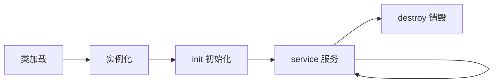

<!-- _class: lead -->

# Servlet 生命周期

## 从 `init()` 到 `destroy()` 的完整旅程

MiniMax151938 · 2026-09-10

📚 配套笔记：[[../Servlet]]

---

## 📋 提纲

1. 什么是 Servlet
2. Servlet 容器
3. **生命周期四阶段**
   - 加载与实例化
   - `init()`
   - `service()` → `doGet/doPost`
   - `destroy()`
4. 关键方法总结

---

## 1. 什么是 Servlet

> **Servlet** = 运行在 Web 服务器 / Servlet 容器中的 **Java 类**
> 用于**接收 HTTP 请求**、**处理业务逻辑**、**返回 HTTP 响应**

```java
// 最简 Servlet 示例
public class HelloServlet extends HttpServlet {
    @Override
    protected void doGet(HttpServletRequest req,
                         HttpServletResponse resp) {
        resp.setContentType("text/html");
        resp.getWriter().println("<h1>Hello, World!</h1>");
    }
}
```

---

## 2. Servlet 容器

Servlet **不直接运行**，由 **Servlet 容器**（如 Tomcat）管理：

- 🏗️ **生命周期管理** —— 创建、初始化、销毁
- 🔌 **请求路由** —— 根据 URL 找到对应 Servlet
- 🧵 **多线程** —— 每个请求一个线程
- 🛡️ **安全** —— 沙箱、权限控制

**常见容器**：Tomcat / Jetty / Undertow / WildFly

---

## 3. 生命周期概览



<div style="text-align: center; color: #888; font-size: 0.8em;">

注：Marp 原生不支持 Mermaid，导 PDF 时可装 markdown-it-mermaid 插件
</div>

---

## 阶段 1：加载与实例化

> 容器启动时（或第一次请求时）发生

- **类加载**：ClassLoader 加载 `.class` 文件
- **实例化**：`new ServletClass()` 调用无参构造
- **单例**：每个 Servlet 类在容器中**只有一个实例**

```java
// 容器内部伪代码
Class<?> clazz = Class.forName("com.example.HelloServlet");
Servlet servlet = (Servlet) clazz.getDeclaredConstructor().newInstance();
```

> ⚠️ 不要在 Servlet 中放共享可变状态（实例变量），多线程会冲突

---

## 阶段 2：`init()`

> Servlet **第一次被请求时**调用，**整个生命周期只一次**

```java
@Override
public void init() throws ServletException {
    // 初始化资源：数据库连接、配置加载
    super.init();
}
```

**常见用途**：
- 📂 加载配置文件
- 🔌 建立数据库连接池
- 📊 初始化缓存
- 🪵 启动后台线程

---

## 阶段 3：`service()`

> **每次请求**都调用，是 Servlet 的"心脏"

```java
@Override
protected void service(HttpServletRequest req,
                       HttpServletResponse resp) {
    // HttpServlet 已实现：根据 method 分发
    // 一般不重写 service()，而是重写 doGet/doPost
}
```

**调用时机**：每个 HTTP 请求 → 一个新线程 → 调一次 `service()`

---

## 阶段 4：`doGet` / `doPost`

> `service()` 默认根据 HTTP method 分发到 `doGet` / `doPost` / `doPut` / `doDelete`

```java
@Override
protected void doGet(HttpServletRequest req,
                     HttpServletResponse resp) {
    // 处理 GET 请求
}

@Override
protected void doPost(HttpServletRequest req,
                      HttpServletResponse resp) {
    // 处理 POST 请求
}
```

---

## 阶段 5：`destroy()`

> 容器**关闭**或 Servlet **被卸载**时调用，**整个生命周期只一次**

```java
@Override
public void destroy() {
    // 释放资源
    super.destroy();
}
```

**常见用途**：
- 🔌 关闭数据库连接
- 💾 持久化缓存
- 🧹 清理临时文件
- 🛑 停止后台线程

---

## 📊 生命周期时序图

```
        容器                    Servlet
         │                        │
         │  1. classloader        │
         ├───────────────────────►│
         │  2. newInstance()      │
         ├───────────────────────►│
         │                        │
         │  3. init()             │
         ├───────────────────────►│
         │                        │
   ┌─────┤  4. service()          │
   │请求1├───────────────────────►│
   │     │  → doGet() / doPost()  │
   │     │                        │
   │请求2├───────────────────────►│
   │     │  service()             │
   └─────┤                        │
         │                        │
         │  5. destroy()          │
         ├───────────────────────►│
         │                        │
```

---

## 📌 关键方法总结

| 方法 | 调用次数 | 用途 |
|------|---------|------|
| 构造器 | 1 次 | 不要放业务逻辑 |
| `init()` | 1 次 | 初始化资源 |
| `service()` | 每次请求 | **一般不重写** |
| `doGet/doPost` | 每次请求 | **业务逻辑** |
| `destroy()` | 1 次 | 释放资源 |

> 💡 **记忆口诀**：**一构一初一毁，多服多请**（构造、init、destroy 各 1 次；service/doGet/doPost 多次）

---

## 🔍 常见面试题

**Q1：Servlet 是单例还是多例？**

A：**单例**。一个 Servlet 类在容器中只有一个实例，多个请求共享。

**Q2：Servlet 线程安全吗？**

A：**默认不安全**。不要在 Servlet 中放共享可变状态（实例变量），用局部变量或同步机制。

**Q3：`service()` 和 `doGet()` 的关系？**

A：`HttpServlet.service()` 内部根据 `req.getMethod()` 分发到对应 `doXxx()`。

---

<!-- _class: lead -->

# 🎉 完

## 配套资源

- 📖 详细笔记：[[../Servlet]]
- 📊 源码：[[../vscode_Java_dev]]
- 🧰 工具：[[../../../tools/marp-guide]]

---

**导出命令**：

```bash
marp Servlet-lifecycle.md --pdf
```
